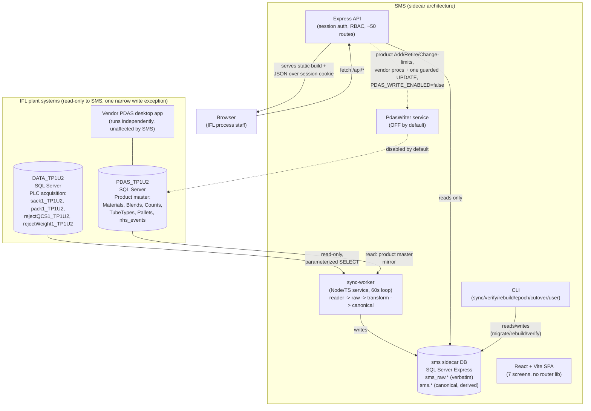

# PROJECT TECHNICAL HISTORY

**Subject:** Sack Management System (SMS) for Ibrahim Fibres Limited (IFL)
**Repository:** `C:\Users\ABDULLAH SAJID\Desktop\sag database` (git remote `origin` → `https://github.com/abz1014/SackManagementSystem.git`); application code under `sms/`
**Branch inspected:** `floor-first-rework` (78 commits, 2026-07-23 → 2026-09-09) plus a large uncommitted working tree (64 modified + 41 new files) dated 10–11 Sep 2026
**Investigation date:** 11 Sep 2026
**Prepared for:** a second technical reviewer who has not inspected this repository, as the technical basis for a separate scope/quotation exercise. This document contains no pricing or commercial content.

**Method note:** this document was produced by three parallel, independently-instructed forensic passes (backend/database/API, frontend/UI, and git-history/decisions) plus a fourth pass covering repository metadata, deployment tooling, and synthesis. Every factual claim below is grounded in source code, git history, or the project's own internal documents — read directly, not recalled. Where a document and the code disagree, both are stated and the disagreement is flagged explicitly (§14, §21, §29). Confidence is marked per §29's scheme (CONFIRMED / STRONGLY INFERRED / INFERRED / UNKNOWN) wherever a claim is not a direct code/doc quotation.

---

## Table of contents

1. [Project Overview](#1-project-overview)
2. [Purpose and Problems Solved](#2-purpose-and-problems-solved)
3. [Technology Stack](#3-technology-stack)
4. [Repository Structure](#4-repository-structure)
5. [System Architecture](#5-system-architecture)
6. [Current System Behaviour](#6-current-system-behaviour)
7. [Feature Inventory](#7-feature-inventory)
8. [Major User Workflows](#8-major-user-workflows)
9. [Database Architecture](#9-database-architecture)
10. [API Architecture](#10-api-architecture)
11. [Frontend / UI Architecture](#11-frontend--ui-architecture)
12. [User Roles and Permissions](#12-user-roles-and-permissions)
13. [External Integrations](#13-external-integrations)
14. [Development History](#14-development-history)
15. [Development Timeline](#15-development-timeline)
16. [Technical Decision History](#16-technical-decision-history)
17. [Problems Encountered and Solutions](#17-problems-encountered-and-solutions)
18. [Current Incomplete Work](#18-current-incomplete-work)
19. [Known Bugs](#19-known-bugs)
20. [Technical Limitations](#20-technical-limitations)
21. [Technical Debt](#21-technical-debt)
22. [Testing Status](#22-testing-status)
23. [Configuration and Environment](#23-configuration-and-environment)
24. [Deployment and Operations](#24-deployment-and-operations)
25. [Security Architecture](#25-security-architecture)
26. [Performance and Scalability](#26-performance-and-scalability)
27. [Requirement / Implementation Traceability](#27-requirement--implementation-traceability)
28. [Technical Dependencies](#28-technical-dependencies)
29. [Open Technical Questions](#29-open-technical-questions)
30. [Technical Assumptions](#30-technical-assumptions)
31. [Current State Assessment](#31-current-state-assessment)
32. [Final Technical Summary](#32-final-technical-summary)
33. [Evidence Index](#33-evidence-index)

---

## 1. Project Overview

**Name:** Sack Management System (SMS).
**Client:** Ibrahim Fibres Limited (IFL), a yarn/textile manufacturer.
**Built by:** a solo developer (git author `abz10141`; the deployment watchdog's basic-auth realm string identifies the developer as "Q Tech Solutions" — `sms/ops/sms-tunnel-policy.yml`), using an AI coding assistant throughout as a development partner. The project's root `CLAUDE.md` is a living engineering brief updated at every phase, and the git history reads as a running engineering log with unusually candid, self-critical commit messages (e.g. *"Fix 7 bugs from full-system stress audit"*, *"Verify the redesign against the running app, and fix what that found"*, *"An audit grepped for the capabilities our own documents claim and found several missing"*).

**Repository state — CONFIRMED, structurally significant:**
- `main` (52 commits, ends 2026-08-19 at `b1c6de2`) is a **strict prefix** of `floor-first-rework` (78 commits, ends 2026-09-09 at `e86357f`) — `git log floor-first-rework..main` returns zero commits. Nothing on `main` has diverged; `floor-first-rework` simply continues past it. Nothing has been pushed to the GitHub remote beyond whatever `main` last held there.
- Every commit from `5f45372` (2 Sep 2026, the floor-first rework) onward — the entire floor-first rework, the full UI redesign, the plant simulator, the "one audience" reversal, and the final stack-overflow fix — exists **only** on `floor-first-rework`.
- The most recent and most architecturally significant body of work — the 10 Sep 2026 strict engineering audit (`sms/AUDIT-FINDINGS.md`) and the 11 Sep 2026 source-generation/PDAS-write-path project (`SEPT-2026-*.md`) — **is not in git history at all**. It exists only as uncommitted working-tree state: 64 modified files and 41 new files, including four new database migrations (024–027), a new sync-worker epoch subsystem, a new API write path, and new test files. `SEPT-2026-BUILD-PLAN.md`'s own status section states this outright: *"Nothing is committed (owner: 'we will commit later')."*
- **Practical implication for a reviewer:** the true current state of the system is the **working tree**, not any git tag or the GitHub remote. Cloning the remote today would reproduce, at best, the `main`-branch state as of 19 Aug 2026 — missing roughly three weeks of the most consequential work, including the entire current 7-screen UI and the September data-generation handling.

**Scale (working tree, current):**

| Measure | Count |
|---|---|
| Application TypeScript/TSX source (5 workspaces, excludes `dist`/`node_modules`) | ~22,459 lines |
| SQL Server migrations | 27 files, ~1,363 lines |
| Backend test files / frontend test files | 27 / 1 |
| Total automated test cases (per the developer's own latest count) | 266 |
| Root + `sms/`-level Markdown documentation | ~6,400 lines across ~20 files (plus a 168 KB raw findings dump) |
| Git commits on the active branch | 78 |

The documentation-to-code ratio here is unusually high for a solo project — this is itself evidence discussed in §21 (Technical Debt) and §14 (Development History): the project treats its own Markdown files as a living, load-bearing status report, not as an afterthought, and that has both disciplined the work and, on at least four occasions, propagated an overclaim that a later self-audit had to retract.

**Target site:** TP1 Line 3 / Unit 2, a yarn spinning line at an IFL plant. The line runs Siemens S7-1500 PLCs that weigh every cone (a package of spun yarn) and every sack, writing readings into two on-premises SQL Server databases via a vendor-supplied tag-acquisition/label-printing product referred to throughout the project as "PDAS." SMS is a second, independent application that reads that data read-only and presents it as dashboards, registers, and — as of 11 Sep 2026, built but shipped disabled — a controlled write path back into the vendor's product master.

**Deployment model:** intranet-first — a single Windows PC/server on the plant LAN, SQL Server Express locally, no cloud dependency for core operation. For remote review by the client during development, the developer additionally exposes the local API over the public internet through an ngrok tunnel gated by HTTP basic authentication (`sms/ops/sms-watchdog.ps1`, `sms/ops/sms-tunnel-policy.yml`), sharing one free-tier ngrok domain with an unrelated sibling project (the developer's "Energy Management System," referenced in `CLAUDE.md`'s opening line as a prior/parallel product). This is a **development/demo convenience**, explicitly not the intended plant deployment topology (§24).

---

## 2. Purpose and Problems Solved

**What is this software?** A reporting and light-write web application that turns two vendor-owned, largely inaccessible SQL Server databases — a PLC acquisition database with no foreign keys, views, or stored procedures, and a product-master database behind a legacy Windows desktop application — into: (a) a queryable historical archive that survives the vendor's own data retention limits (IFL's live tables hold roughly one rolling month), (b) role-gated dashboards and registers for cone/sack/reject data, a weight control-chart analytics layer, and calibration advisories, and (c) — newly built and still switched off pending written client sign-off — a safe, audited way for the client's own process engineers to add or retire a product and adjust its target weight, replacing their current practice of hand-writing SQL statements directly against the vendor's database.

**Who uses it?** IFL's process-department staff: the plant GM, managers, and process/quality engineers. This was explicitly re-confirmed by the client partway through the project (2 Sep 2026) after the developer had briefly — and, on IFL's correction, incorrectly — assumed a second, non-technical floor-worker audience and split the UI by role for it. The split was reversed the same day once IFL's own representative clarified there is one technical audience, not two (§16, "Removal of role-based read tiers").

**What problem was it created to solve?**

1. **No historical depth.** IFL's own acquisition database is periodically rebuilt by the vendor (identities reset, columns renamed and added — this happened for real on 2026-08-05, §17) and retains roughly a rolling month; anything older is gone from IFL's own system entirely. SMS's sidecar database is the only place a full production history can accumulate.
2. **No reporting/analytics layer.** The vendor's acquisition database (`DATA_TP1U2`) has no views, stored procedures, or foreign keys — a bare set of wide tables fed by a tag-acquisition layer. Nothing upstream computes shift boundaries correctly (the plant's own stored shift value is derived from insert time and is measurably wrong on a material share of rows — §17), control-chart statistics, reject trends, or an "is the line running right now" signal.
3. **No product-aware judgement of readings.** For most of the project's life the two source databases could not be joined at all — no shared key existed between a weighing and the product that was running when it was weighed. IFL's own August 2026 database rebuild incidentally added a `MaterialId` column to every reading, which SMS now uses as a real, per-reading product key (§16, §17 — one of the most significant technical turns in the project).
4. **No safe way to change a running product's target weight.** IFL's process engineers reportedly do this today by hand-writing SQL against the product-master database (`PDAS_TP1U2`), confirmed indirectly by that database's own audit log showing four consecutive vendor stored-procedure errors from one of their engineers attempting exactly this on 18 Aug 2026. SMS's write path (built, disabled by default) is designed to replace that practice with an audited, role-gated UI action that goes only through the vendor's own stored procedures — never a raw table write, except for one narrowly-scoped, explicitly justified exception (§9.5, §17).

**What manual process / legacy system is being improved?** The vendor-supplied acquisition/label system ("PDAS") already exists and keeps running unchanged underneath SMS. SMS does not replace it; it reads alongside it, and, for the one narrow write path, calls its own stored procedures rather than bypassing it. The manual processes SMS targets are: (a) ad-hoc, undocumented SQL queries against production data for reporting; (b) a hand-maintained database view (`GetMaterialsData`) that one of IFL's own process engineers created in August 2026 — confirmed by IFL, 11 Sep 2026 — as a personal workaround, because no product-master screen existed anywhere; and (c) direct hand-written `UPDATE`/`INSERT` SQL against the product-master tables when a product's target weight needs to change.

**Overall workflow, today, once the sync worker is pointed at IFL's live server (§8, §9 have the full detail):** the sync worker polls IFL's acquisition database on a fixed interval, detects new rows past a per-source-generation watermark, writes them to a raw layer verbatim, transforms them into a canonical layer (attaching corrected shift, plant-clock timestamps, product attribution, and data-quality flags), and the Express API reads only the canonical/sidecar tables to serve the React frontend. A second, narrower path — new as of 11 Sep 2026 and shipped disabled — lets a role-gated user in the UI issue a product add/retire/limit-change action that the API sends through the vendor's own stored procedures against the product-master database.

---

## 3. Technology Stack

### Backend

| Layer | Choice | Version / evidence |
|---|---|---|
| Language | TypeScript, `strict: true`, `noUncheckedIndexedAccess: true`, `noImplicitOverride: true` | `sms/tsconfig.base.json` |
| Runtime | Node.js 20+, ESM (`"type": "module"` in every workspace) | `DEPLOY.md`; all `package.json` files |
| Web framework | Express `^4.19.2` | `api/package.json` — used only in the `api` workspace |
| SQL Server driver | `mssql` `^11.0.1` (Tedious under the hood) | Used directly by `sync-worker`, `cli`, `api` — no ORM anywhere; every query is hand-written, parameterized SQL |
| Runtime validation | `zod` `^3.23.8` | Env config schemas, and pervasive inline route query/body schemas in `api/src/app.ts` |
| Password hashing | `argon2` `^0.41.1` | `cli` (`user:create`), `api` (`auth.ts`, `services/admin.ts`) |
| Build | TypeScript project references (`tsc -b`) | Dependency graph: `shared` ← `sync-worker` ← `cli`/`api` |
| Test runner | `vitest` `^2.0.5` | One root config (`sms/vitest.config.ts`, `environment: 'node'`) covers all backend workspaces |
| Monorepo | npm workspaces | `shared`, `sync-worker`, `cli`, `api`, `web` |

SQL Server feature usage implies a **SQL Server 2012+** target, and the project explicitly targets **SQL Server Express** (the developer's own docs discuss its 10 GB per-database cap as a real constraint — §20, §26): `PERCENTILE_CONT ... WITHIN GROUP`, `OFFSET ... FETCH NEXT`, `sp_getapplock`/`sp_releaseapplock`, `THROW`, and window functions (`LAG`, `ROW_NUMBER`) are all used. Every mssql connection sets `useUTC: true` so DATETIME columns round-trip as the plant's own wall-clock values without silent timezone conversion — the load-bearing mechanism behind the project's "two clocks" discipline (§30).

**No PLC/industrial-protocol library of any kind** exists in any of the five package manifests — verified directly, not merely by absence of intent. This is a deliberate, explicitly-enforced-by-review constraint (§16, §29 — Q22).

### Frontend

| Layer | Choice | Version / evidence |
|---|---|---|
| Framework | React 18.3.1, `createRoot` API, `<React.StrictMode>` | `sms/web/package.json`, `main.tsx` |
| Build tool | Vite 5.4.0 | `vite.config.ts` — dev server on 5173, `/api` proxied to `localhost:4000`; production build is `tsc -b && vite build` |
| Routing | **None — no router library at all** | Confirmed: no `react-router-dom` or equivalent in `package.json`. Navigation is hand-rolled query-string state in `App.tsx`, using `window.history.pushState` directly and a manual `popstate` listener. This is a stated, deliberate design choice (`App.tsx`'s own header comment: "a link pasted to a colleague opens on the same period in their browser"). |
| State management | None (no Redux/Zustand/MobX/Recoil) | Local `useState`/`useEffect` per component, one React Context (`LiveCtx`) for the polled `/api/live` result, a hand-written generic polling hook (`usePolling`), and exactly one `localStorage` key (the UI text-size scale preference) |
| Styling | One hand-written CSS file (816 lines), custom-property design-token system | `sms/web/src/app.css` — a genuine token system: six type steps that all scale via one `--ui-scale` variable, a strict "one accent color means exactly one thing" rule, and documented WCAG contrast ratios inline as comments. No Tailwind, no CSS-in-JS, no CSS modules. |
| Fonts | One self-hosted variable font, Instrument Sans (400–700 weight range) | `app.css`; physically present at `web/public/fonts/InstrumentSans-Variable.woff2`. Chosen because the plant PC has no internet — a Google Fonts link would silently fall back to Segoe UI on the one machine that matters (`main.tsx` comment). |
| UI component library | **None** | No MUI/Chakra/Ant/Radix. No chart library (Recharts/D3/Chart.js) — every chart in `ui/chart.tsx` is hand-built inline SVG. No form library. |
| Theming / dark mode | **None, deliberately** | `app.css` sets `color-scheme: light` at `:root` with an explicit comment: "The plant PC is a fixed, known machine and the app is read in daylight on a bright floor; a dark theme would be a second design to maintain and a second contrast audit to pass. The page commits to one look deliberately." |
| TypeScript config | `strict: true`, `noUnusedLocals: true`, `noUncheckedIndexedAccess: true`, `noEmit: true` | `sms/web/tsconfig.json` — note `noUnusedLocals` catches unused *local* variables only, not unused *exports*, which is exactly the gap that let a large amount of dead exported code accumulate in `api.ts` (§21). |

Two frontend dependencies are stale, confirmed dead weight: `@fontsource/archivo` and `@fontsource/dm-mono` remain in `package.json` from a prior visual generation of the app (superseded by Instrument Sans on 3 Sep 2026) — zero imports of either anywhere in `src/` (§21).

### No CI/CD pipeline

No GitHub Actions workflow or any other CI configuration file exists anywhere in the repository (confirmed by an exhaustive search for `.yml`/`.yaml` files — the only YAML file present is the unrelated ngrok traffic-policy file). Testing, type-checking, and verification (`vitest run`, `tsc -b`, the CLI's own `sms verify`) are run locally by the developer before each commit, evidenced by the git history's commit messages routinely stating fresh test counts and build status.

---

## 4. Repository Structure

```text
sag database/                        # git repo root
├── CLAUDE.md                        # living engineering brief / decision log (root doc, ~36K, updated continuously)
├── SCHEMA.md                        # source-of-truth for IFL's two DB schemas (Phase 0 discovery)
├── SPEC.md                          # Phase 1 scope + sidecar schema design
├── ARCHITECTURE.md                  # Phase 2 "frozen build contract"
├── QUESTIONS.md                     # 22 client-facing questions, plain language, with recorded answers
├── CAPABILITIES.md                  # screen-by-screen "what the software does" — PARTLY STALE, see §14
├── REDESIGN.md                      # brief + rationale for the Sep 2026 full UI redesign
├── DECISIONS-PENDING.md             # numbered open decisions awaiting owner/client input
├── IFL_SACK_STOCK_QUESTION.md       # one blocking question drafted for the client, not yet sent
├── SEPT-2026-DB-BRIEFING.md         # Sep 2026 database-rebuild investigation + recommendations
├── SEPT-2026-DB-FINDINGS-RAW.md     # raw findings dump backing the briefing (168 KB)
├── SEPT-2026-EPOCH-DECISION.md      # design-decision document for the source-generation ("epoch") mechanism
├── SEPT-2026-BUILD-PLAN.md          # step-by-step build plan + end-of-build status (11 Sep 2026)
├── introspect.sql, dq.sql, dq2.sql  # one-off DB introspection/profiling scripts (Phase 0)
├── design/                          # design-tool handoff artifacts (design canvases, tokens; includes an
│                                    #   interim "UI rework" spec later superseded by REDESIGN.md — see §14)
├── extracted/, extracted-sps-*/, schema_dump/   # unpacked vendor DB exports — gitignored, not shipped
└── sms/                             # the application monorepo
    ├── DEPLOY.md                    # deployment & operations runbook
    ├── AUDIT-FINDINGS.md            # 10 Sep 2026 strict engineering audit (uncommitted)
    ├── README.md
    ├── package.json                 # npm workspaces root: shared, sync-worker, cli, api, web
    ├── db/migrations/               # 27 sequential .sql migrations — the sidecar schema history
    ├── scripts/                     # migrate.mjs, backfill-source-epoch.mjs, simulate-plant.mjs (+schema),
    │                                #   backup-appdb.ps1
    ├── ops/                         # sms-watchdog.ps1, install-sms-watchdog.ps1, sms-tunnel-policy.yml
    │                                #   — a dev/demo public-exposure watchdog, NOT the plant deployment path
    ├── shared/src/                  # @sms/shared — cross-cutting domain types/config
    │   ├── config/appConfig.ts      #   env config schema + interpretWeight()
    │   └── domain/                  #   plantClock, shift, version, events.ts (dead — see §21)
    ├── sync-worker/src/             # @sms/sync-worker — IFL SQL Server → raw → canonical pipeline
    │   ├── reader/                  #   IflSqlAdapter, iflTables (column maps), fingerprint (schema-drift gate)
    │   ├── raw/                     #   persistRaw — raw-layer writes
    │   ├── transform/                #   transform, runTransform, persistCanonical, dq (data-quality), wallClock
    │   ├── seed/                    #   seedProducts, seedReference, seedRejectCodes
    │   ├── epoch.ts, lock.ts, pipeline.ts, runner.ts, store.ts
    ├── cli/src/commands/            # @sms/cli — sync, verify, summary, rebuild, user, epoch, cutover
    ├── api/src/                     # @sms/api — Express REST API (session auth, RBAC)
    │   ├── app.ts                   #   ~1,300 lines — every route
    │   ├── auth.ts, security.ts, cache.ts, envelope.ts, config.ts
    │   └── services/                #   22 domain-area service modules (see §7, §9, §10)
    └── web/src/                     # @sms/web — React + Vite frontend
        ├── App.tsx                  #   the whole shell: routing, session, rank gates, per-screen wiring
        ├── api.ts                   #   the typed API client — every request/response shape
        ├── screens/                 #   Line, Readings, Weight, Rejects, Report, Setup, Wall, Login,
        │                            #     + sheet overlays: ReadingSheet, ProductSheet, StationSheet
        ├── ui/                      #   shared components: Sheet, Bar, chart, bits
        └── lib/                     #   fmt, period, words, strings (dead), health, live — shared rules
```

**Note on `design/`:** this directory holds artifacts from an AI-assisted design-canvas tool used mid-project, including an interim "UI rework" specification (`design/STATUS.md`) describing a three-column shell with routes like `?v=dashboard`/`?v=performance`/`?v=shift`. That generation shipped on 18 Aug 2026 and was itself fully replaced (not merely restyled) by the 3 Sep 2026 redesign described in `REDESIGN.md` and built into the current `web/src/screens/`. `design/STATUS.md` is therefore a historical record of an intermediate, now-superseded UI generation, not a description of the current app — a fact not stated anywhere in the file itself.

---

## 5. System Architecture

### 5.1 Shape

SMS is a **sidecar-sync architecture**: a locally-owned SQL Server database ("the sidecar" or "app DB") is kept in sync, read-only, from IFL's two production databases, and every part of the application other than the sync worker itself reads exclusively from the sidecar. This was a deliberate decision (§16, decision D0) made to resolve a three-way tension in the client's own stated requirements: IFL asked SMS to "connect directly" to their live database (Q19), while separately forbidding any modification to it — including adding indexes (Q21) — and separately requiring an app-owned place to record a "current product" selection that does not exist in IFL's own schema (Q1). A sidecar satisfies all three: it connects to IFL only to read, needs no permission to index anything (the sidecar is entirely SMS's own), and gives SMS a natural place to keep first-class business data IFL's systems have no room for.



### 5.2 Layers

- **Presentation:** React SPA (`web/`), served as static files by the same Express process that answers the API in production (`WEB_DIST` path, `express.static`) — there is no separate frontend server at runtime.
- **API / controller layer:** Express routes in `api/src/app.ts`, each validating input with `zod`, checking a session and rank via `requireRole(n)` middleware, and delegating to a service function.
- **Application / business layer:** ~22 single-purpose service modules under `api/src/services/` (production, live/health, weights, rejects, reject-SPC, calibration/Nelson-rules, product attribution, product limits, PDAS writes, register/export, operations, admin, audit, downtime, report). No service function itself checks a caller's rank — that is enforced exclusively at the route-registration layer (a defense-in-depth gap discussed in §25).
- **Domain layer:** `shared/src/domain/` — plant-clock arithmetic, shift-boundary rules, a version marker. Deliberately tiny and dependency-free so it can be imported by both the sync worker and (in principle) the API.
- **Data-access layer:** no ORM anywhere; every query is hand-written parameterized SQL via the `mssql` driver, `pool.request().input(...).query(...)`.
- **Background service:** the sync worker (`sync-worker/`) is a separate long-running Node process, independent of the API process, intended to run as its own Windows Service.
- **CLI:** a separate binary (`sms`) sharing the sync-worker's core logic, for one-shot operational commands (sync, verify, rebuild, epoch management, cutover, user creation).

### 5.3 Two-layer data pipeline: raw → canonical

This is the architectural spine of the backend, frozen as a build contract on 23 Jul 2026 (`ARCHITECTURE.md`) and still in force:

- **Raw (`sms_raw.*`)** is a verbatim, append-only, uninterpreted column-for-column copy of IFL's four wide tables, keyed on the source's own row id scoped to a source generation (§9.3). Nothing is computed here.
- **Canonical (`sms.cone_event` / `sack_event` / `reject_event`)** is produced by pure, side-effect-free mapping functions (`sync-worker/src/transform/transform.ts`) — corrected shift code/date (from production time, not IFL's insert-time-derived value), a cross-source merge key, product attribution, and a `transform_version` stamp. Canonical is always fully re-derivable from raw via `sms rebuild`, without ever re-reading anything from IFL.

The stated reason (`CAPABILITIES.md`): *"so a disputed figure can always be traced back to the bytes that produced it."* This design proved load-bearing in practice: when IFL reset every source table's identity counter on 5 Aug 2026, the fact that raw was a durable local copy meant the canonical layer's own deduplication key could be moved from IFL's now-unreliable row id to the sidecar's own `raw_id` identity column, without needing to re-read anything from IFL (§16, §17).

### 5.4 Frontend architecture shape

The frontend has **no client-side router** — every navigable piece of state (current screen, period, an open detail sheet, a replay instant, a register filter) lives in the URL's query string, parsed and written by hand in `App.tsx` using `window.history.pushState` directly and a manual `popstate` listener. There is likewise no external state-management library; a single React Context distributes the polled "live" state (current line status, plant clock, freshness) to every screen. This is a deliberate minimalism choice consistent with the rest of the stack (no ORM, no UI framework, no chart library) — the whole application is built from first principles on top of React + Vite + hand-written CSS, with cross-screen consistency enforced by convention (shared `ui/` primitives, shared `lib/` rule modules) rather than by a framework.

---

## 6. Current System Behaviour

**What the software actually does today, end to end, once the sync worker is pointed at a live source (verified in the browser against a running instance during this and prior investigation sessions):**

1. **Sync worker cycle (every 60 seconds by default).** For each of IFL's four wide tables, the worker resolves which physical "generation" of that table it is currently reading (§9.3), checks that the source has not gone backwards (a restore/reseed guard), reads any rows past its last watermark plus a small overlap window, writes them to the raw layer (idempotent, deduplicated), and raises a data-quality finding if it reads a meaningful number of new source rows but somehow persists none of them. Every pass is recorded in `sms.sync_run` regardless of outcome.
2. **Transform, immediately following each raw ingestion.** New raw rows are mapped into canonical form: shift is recomputed from the plant's actual production timestamp (not IFL's own stored, insert-time-derived value, which is measurably wrong on part of the data — §17); a merge key is computed to reconcile any future second data source; product attribution is resolved — a September-2026-or-later row carries its own material id and is judged against that specific product's limits, while an older row falls back to whatever product was manually recorded as "current" at that timestamp. Data-quality findings (future timestamps, non-positive weights, missing station, outliers, merge collisions) are raised and deduplicated.
3. **The API reads only the sidecar.** Every one of its ~50 routes queries the local canonical tables; none of them ever contacts IFL's database directly at request time. A thin caching layer (5-second default TTL) sits in front of the more expensive aggregate queries.
4. **A signed-in user sees seven screens** — Line (the home/overview screen), Readings (the full sack/cone/reject register), Weight (control-chart and per-station calibration view), Rejects (reason breakdown and trend), Report (period summaries, printable/exportable), Setup (admin-only: people, stations, rules, sync health, audit log), and Wall (a fullscreen, chrome-free display meant for a monitor on the floor). A detail "sheet" overlay opens on top of any of these for a single reading, station, or the current product.
5. **Every screen shares one global period control** (This shift / Today / Yesterday / a custom range) anchored on the plant's own clock as reported by the API — never the browser's clock — and one shared "how stale is the data" sentence in the top bar, computed server-side from the oldest of the four source feeds, not the newest (so one dead feed cannot hide behind three healthy ones).
6. **Pattern detectors** (station drift, the attention list, reject episodes) deliberately ignore whatever period the user has selected and always look at a fixed trailing 14 production days, because their statistical tests need several consecutive days of data and a single shift is one point.
7. **Writes are minimal and audited.** A signed-in user of sufficient rank can: set the line's manually-tracked "current product" (used only as a fallback for readings that predate per-reading attribution); log a calibration adjustment against a station; and, if the (currently disabled) PDAS write path is turned on, add, retire, or change the weight limits of a product in IFL's own product-master database, via the vendor's own stored procedures, with every such action recorded in SMS's own audit trail because the vendor's own database keeps none.
8. **Nothing else writes to IFL's acquisition database, ever**, under any configuration — this is a hard, enforced project rule (§25, §30) with no exception.

---

## 7. Feature Inventory

Status legend: **COMPLETE** (built, wired end to end, verified) · **PARTIAL** (built but with a real, named gap) · **BUILT, DISABLED** (fully built, functions correctly, switched off by a runtime flag) · **INCOMPLETE** (started, missing a necessary piece) · **NOT BUILT** (no implementation exists) · **DESIGNED ONLY** (documented intent, zero code).

| # | Feature | Layer | Status | Evidence |
|---|---|---|---|---|
| 1 | Read-only sync pipeline (IFL → raw → canonical) | Backend | **COMPLETE** | `sync-worker/src/{runner,pipeline}.ts`; incremental since a mid-project fix, not a full-history rescan each pass |
| 2 | Source-generation ("epoch") tracking | Backend | **COMPLETE**, uncommitted | `sync-worker/src/epoch.ts`, migrations 025–026, `cli/commands/epoch.ts`; 17+ dedicated regression tests |
| 3 | Row-level product attribution (September-onward data) | Backend | **COMPLETE** for post-2026-08-05 rows; **permanently `none`, by design**, for older rows | `transform.ts:attribution()`, `productAt.ts`; 12 tests |
| 4 | Time-versioned product weight limits | Backend | **COMPLETE** | `productLimits.ts`, migration 027; 7 tests |
| 5 | PDAS product write path (Add / Retire / Change-limits) | Backend + Frontend | **BUILT, DISABLED** (`PDAS_WRITE_ENABLED=false`); transactional path never run against a real PDAS | `pdasWrite.ts`, `ProductSheet.tsx`; 6 offline tests only |
| 6 | Calibration advisory (Nelson rules, per-station drift, adjustment ledger) | Backend | **COMPLETE** | `nelson.ts` (21 tests), `calibration.ts` |
| 7 | Reject control chart (p-chart), cross-generation aware | Backend | **COMPLETE** | `rejectSpc.ts`; dedicated cross-generation test |
| 8 | Live/health detection (running/stopped/idle, freshness, acquisition lag) | Backend | **COMPLETE**, hardened after a real production-class bug (§17) | `live.ts`; 11 tests including the reproduced lag regression |
| 9 | RBAC (4 ranks, write-only gating) | Backend + Frontend | **COMPLETE**, cross-verified client/server | `auth.ts`, `App.tsx`; full route-matrix integration test |
| 10 | Backup / restore | Ops | **COMPLETE and rehearsed** against real data | `scripts/backup-appdb.ps1`; dated rehearsal found and fixed 3 real defects |
| 11 | CLI (sync / verify / summary / rebuild / epoch / cutover / user) | Backend | **COMPLETE** | `cli/src/commands/*`; `verify.test.ts` |
| 12 | Adapter-based ingestion (pluggable second data source) | Backend | **DESIGNED ONLY** | Zero hits for `IngestionAdapter` anywhere; `ARCHITECTURE.md`/`SPEC.md` self-correct this in place |
| 13 | PLC direct reader (Component B) | Backend | **NOT BUILT, out of scope by client answer (Q22)** | Env keys declared, read by no code, asserted by no test; no PLC library in any manifest |
| 14 | 7-screen redesigned UI shell (Line/Readings/Weight/Rejects/Report/Setup/Wall) | Frontend | **COMPLETE** | `web/src/{App.tsx, screens/}` |
| 15 | Detail "sheet" overlays (reading / station / product) | Frontend | **COMPLETE**, genuinely accessible (focus-trapped dialog) | `ui/Sheet.tsx`; wired for all three kinds |
| 16 | CSV export — register | Frontend + Backend | **COMPLETE**, server-streamed | `Readings.tsx`, `GET /api/events/export` |
| 17 | CSV export — Report | Frontend | **COMPLETE**, client-generated | `Report.tsx`, `csv.ts` |
| 18 | CSV export — Weight, Rejects | Frontend | **NOT BUILT** | No `csv.ts` usage outside `Report.tsx` |
| 19 | Print styles | Frontend | **COMPLETE** | `app.css` `@media print` block |
| 20 | Wall (fullscreen floor/monitor display) | Frontend | **COMPLETE** | `Wall.tsx` |
| 21 | Replay mode (`?at=`) | Frontend + Backend | **COMPLETE**, dev-only by server flag | `LIVE_ALLOW_AS_OF`; banner in `App.tsx` |
| 22 | Setup → Rules editing (weight basis / shift / plausibility) | Frontend | **INCOMPLETE** — server support exists, no UI form | `api.ts`'s `adminSetWeightRule` etc. never called from any screen; `Setup.tsx`'s Rules block is read-only |
| 23 | Setup → *Product limits* rule | Frontend | **NOT BUILT** | Confirmed absent; tracked as open in `CLAUDE.md`/`DECISIONS-PENDING.md` |
| 24 | Per-day-per-code reject reason sheet | Frontend | **NOT BUILT** | Confirmed absent from `Rejects.tsx` |
| 25 | Sack stock tracking per machine | Backend + Frontend | **NOT BUILT, not buildable from the data IFL has supplied** | `sack1_TP1U2` carries no machine/station column; question drafted, not sent |
| 26 | Role renaming (operator/supervisor/manager/admin → viewer/engineer/manager/admin) | Frontend | **NOT BUILT** | Code still uses the original four names everywhere |
| 27 | Multi-line support | Backend | **PARTIAL** — `line_id` threaded everywhere, never exercised against a real second line | `CLAUDE.md` requirement mapping |
| 28 | Dark mode / theming | Frontend | **NOT BUILT, deliberately** | `app.css` explicit one-look design decision |
| 29 | Text-size scaling (Desk/Wall) | Frontend | **COMPLETE** | `ui/Bar.tsx`, `--ui-scale` |
| 30 | Accessibility (focus trap, skip link, keyboard row activation) | Frontend | **COMPLETE**, evidently deliberate | `Sheet.tsx`, `App.tsx`, `bits.tsx` |

---

## 8. Major User Workflows

### 8.1 Opening the app / login / session check

The app renders a blank shell, calls `GET /api/auth/me`, and shows either the login screen or the authenticated session shell depending on the response. A global 401 handler means **any** future API call that comes back unauthorized (e.g. an expired session while the tab was open) bounces the whole app back to the login screen automatically. A network failure at this very first call is treated identically to "not logged in" — there is no differentiated message for a plant-link outage at load time (§19).

### 8.2 Viewing production on the Line screen (the home screen)

The shell polls `GET /api/live` for the line's current state and the plant's own clock, resolves the user's selected period against that clock (never the browser's), and the Line screen independently polls production totals, per-station activity, the current product, and an "attention" list of things worth a look — each panel failing and retrying independently rather than one failure blanking the whole screen. Station boxes dim after 20 minutes of silence and open a station detail sheet on click.

### 8.3 Opening a single reading and resolving its product attribution

Clicking any register row opens a detail sheet that fetches the row's full detail and asks the API "what product applied at this exact timestamp" — passing the row's own material id when it has one. The API answers `'row'` (the reading carries its own product, September-2026-onward data), `'timeline'` (falls back to the hand-set line-wide product history, for older data), or nothing at all. This distinction exists specifically because up to six different products can run concurrently on different machines, so judging a reading by "whatever was manually selected as current" is wrong once a reading knows its own product.

### 8.4 Filtering, paging, and exporting the Readings register

Users toggle between cones/sacks/scale-rejects/pre-weighing-rejects, filter by station, and can arrive already filtered from another screen (e.g. "these cones were outside their product's limits"). CSV export of the register is a plain browser download from a server-streamed endpoint (capped and separately rank-gated), architecturally distinct from Report's export, which is generated client-side from data the page has already fetched.

### 8.5 Viewing Rejects and the source-generation boundary

The Rejects screen computes both a trailing statistical window and the user's selected period, and — because IFL's own August rebuild created a hard discontinuity in the data — explicitly tells the user when their selected window spans that boundary, since reject rates are computed separately on each side of it and never pooled across it.

### 8.6 Viewing Weight and the one station table

A single station table appears once in the entire application (on the Weight screen) and, deliberately, shows each station's deviation from **both** the line average and the product target — a fix for a documented earlier defect where showing only "distance from the line average" made a line that was uniformly 12 g heavy everywhere read as "fine" on all fourteen rows.

### 8.7 Setup (admin only)

One scrolling page with five sections: sync health (including, per row, which source generation and watermark produced it), station naming, rules (read-only display today — see §7, item 22), people (create/edit accounts and roles), and an audit log. The whole screen is gated to the top rank; nothing inside it is reachable by a typed URL at a lower rank because the server independently enforces every one of its routes.

### 8.8 The product sheet — viewing history and the (disabled) write path

Opens from the Line screen's "Change" button or its product-history link. Shows the current product and, on request, its full changeover history. If the PDAS write path is enabled and the signed-in account is rank 3 or above, it additionally offers forms to create a new product, retire/activate one, or change its weight limits — each going through the vendor's own stored procedures (or, for a limits change, one narrowly-scoped guarded update, because no vendor procedure for that exists at all). With the flag off, the same screen renders read-only and states plainly why.

### 8.9 Wall mode

A fullscreen, chrome-free rendering of the line's current state, intended for a monitor near the line. It never blanks on a failed poll — it keeps showing the last good reading and states the problem in its footer instead, on the stated principle that a blank wall display looks like a dead PC.

### 8.10 The global period control and data-freshness sentence

Six period options, always resolved against the plant's own reported clock. A single sentence in the top bar states how stale the newest data is, computed from the *oldest* of the four source feeds specifically so one dead feed cannot hide behind three healthy ones. A `?at=` URL parameter can freeze the whole app at a past instant for demonstration or verification purposes, in development only, always shown with an unmistakable on-screen banner.

---

## 9. Database Architecture

### 9.1 IFL's source databases, as SMS reads them

**`DATA_TP1U2`** (the plant's live PLC acquisition database — also seen in this project as `DATA_TP1U2_SIM` for the developer's own simulator, or `DATA_TP1U2_SEP07` for the September 2026 sample) is read exclusively through one adapter, whose column mapping is centralized in a single file (`sync-worker/src/reader/iflTables.ts`) described in its own header as "the coupling boundary" — the one place the rest of the codebase's IFL-specific knowledge is meant to live:

| Source table | Raw sidecar table | Columns read |
|---|---|---|
| `pack1_TP1U2` (cones) | `sms_raw.cone_raw` | `id, Date, Shift, Area, ProductionDate, HangerNum, MachineNo, Lifter, Weight, inRange, MaterialId` |
| `sack1_TP1U2` | `sms_raw.sack_raw` | `id, Date, Shift, Area, SackNum, Weight, inRange, MaterialId` |
| `rejectQCS1_TP1U2` | `sms_raw.reject_qcs_raw` | `id, Date, Shift, Area, ProductionDate, HangerNum, MachineNo, Lifter, TubeInspectResult, MaterialInspectResult, MaterialId` |
| `rejectWeight1_TP1U2` | `sms_raw.reject_weight_raw` | `id, Date, Shift, Area, ProductionDate, HangerNum, MachineNo, Lifter, Weight, MaterialId` |

Reads are always `SELECT [named columns] FROM [table] WHERE [id] > @after ORDER BY [id]`, fully parameterized. The raw, narrow (EAV-style) versions of these tables that IFL also exposes are never queried — consistent with the project's own data-model documentation, which notes they hold six times the row count for zero additional information. `DATA_TP1U2.Users` (a table with three plaintext-password accounts, per the project's own security notes) is never read by any application code.

**`PDAS_TP1U2`** is read for the product master (mirrored into the sidecar every sync pass) and, only when the write path is enabled, written to via two vendor stored procedures plus one narrowly-scoped direct update (§9.5).

### 9.2 The sidecar schema — all 27 migrations

| # | Migration | Purpose |
|---|---|---|
| 001 | `001_schema.sql` | Creates the `sms` schema |
| 002 | `002_sync_run.sql` | `sms.sync_run` — one row per sync pass per table, the operational audit trail of ingestion |
| 003 | `003_cone_event.sql` | `sms.cone_event` — canonical cones; includes a nullable `cone_id`/`cone_id_source` pair reserved for a future PLC integration that has never been populated |
| 004 | `004_sack_event.sql` | `sms.sack_event` — canonical sacks, plus a flag marking that a sack's timestamp is insert-time, not a true event time |
| 005 | `005_raw_layer.sql` | The four verbatim raw tables |
| 006 | `006_reference.sql` | Units, stations, reject codes, versioned shift/weight rules, and the PDAS product-master mirror tables (blend, count, tube type, product) |
| 007 | `007_product_timeline.sql` | Append-only "current product" changeover history |
| 008 | `008_reject_event.sql` | `sms.reject_event` — unifies quality and weight rejects into one table |
| 009 | `009_dq_finding.sql` | Data-quality finding log, severity-checked (`INFO`/`WARNING`/`ERROR`/`CRITICAL`) |
| 010 | `010_app_config_and_rebuild.sql` | A scalar key-value config table, plus the rebuild-audit trail |
| 011 | `011_auth.sql` | Roles, users (argon2 hashes), sessions |
| 012 | `012_product_offsets.sql` | Adds the real tolerance offsets from PDAS to the product mirror |
| 013 | `013_plausibility_rule.sql` | Versioned scale-fault detection window, replacing hardcoded constants |
| 014 | `014_audit_log.sql` | A cross-cutting actor/action/target audit log |
| 015 | `015_calibration_adjustment.sql` | The calibration adjustment ledger |
| 016 | `016_dq_finding_dedupe.sql` | One-time cleanup of duplicate findings from before batch-scoped deduplication existed |
| 017 | `017_rebuild_audit_failure.sql` | Adds an error-message column so a failed rebuild is distinguishable from one still running |
| 018 | `018_sync_run_line_index.sql` | Performance index for the Operations screen's frequent poll |
| 019 | `019_calibration_adjustment_amount.sql` | Adds the signed-gram amount an adjustment ledger needs to be useful at all |
| 020 | `020_product_color.sql` | Captures a PDAS field that was previously silently dropped during seeding |
| 021 | `021_source_station_index.sql` | Performance indexes for per-station queries |
| 022 | `022_schema_migration_history.sql` | A migration-tracking table |
| 023 | `023_shift_rule_marker.sql` | Stamps every canonical row with which shift-attribution rule produced it, so a rule change is detectable after the fact |
| 024 | `024_september_source_schema.sql` | Renames a source column (`Source`→`MachineNo`), adds the new `MaterialId` column across all four raw tables and to the reject canonical table |
| 025 | `025_source_epoch.sql` | **`sms.source_epoch`** — see §9.3 |
| 026 | `026_source_epoch_constraints.sql` | Makes the epoch link mandatory; re-keys uniqueness around it |
| 027 | `027_product_limit_history.sql` | **`sms.product_limit_version`** and **`sms.product_change`** — see §9.4 |

### 9.3 Source generations (`sms.source_epoch`) — what problem it solves

This mechanism exists to survive the consequence of IFL dropping and recreating all four of its wide acquisition tables on 2026-08-05, an event which reset every identity counter to 1 (§17). Without a generation concept, September's newly-arriving rows (numbered 1 upward again) would either be silently discarded as "already seen" against July's occupied id range, or — once past that range — would eventually collide with old rows under the same numeric id. `sms.source_epoch` names each physical generation of each source table by its server, database, and the source table's own creation timestamp, with a filtered unique index guaranteeing at most one open generation per table at a time. Every raw and canonical row, and every sync-run record, is linked to the generation that produced it. Critically, **registering a new generation is a deliberate, manual act** (a specific CLI command, never automatic) — the mechanism was designed this way after an earlier draft's auto-registration idea was shown to double-count the developer's own test data under a plausible edge case (§16).

### 9.4 Time-versioned product limits — what problem it solves

The product mirror table is refreshed wholesale on every sync pass, so a setpoint change (by SMS, or by an IFL engineer editing it by hand in the database) used to silently re-judge every historical reading ever attributed to that product against *today's* tolerance rather than whatever was in force when the reading was actually taken. `sms.product_limit_version` is an append-only history of every observed or written set of limits, each with an effective-from timestamp; `sms.product_change` is the audit trail of every write attempt SMS makes against the vendor's database — since the vendor's own system keeps no history of such edits at all, this table is the only record that will ever exist that a limit was changed.

### 9.5 Vendor stored procedures depended on

`pdasWrite.ts` calls exactly two vendor stored procedures — `CreateMaterial` (insert, keyed on a blend/count/tube-type triple, refuses a duplicate) and `SetMaterialStatusActive` (an active/inactive flag flip) — plus one narrowly-scoped exception: because the vendor provides **no procedure at all for changing a setpoint or tolerance**, and because their own `CreateMaterial` refuses to "retire and recreate" the same yarn under a new target weight (proven in the vendor's own audit log by four consecutive errors from one of IFL's own engineers attempting exactly this on 18 Aug 2026), SMS performs one single-row, fully parameterized, transaction-wrapped `UPDATE` against the vendor's `Materials` table for a limits change — and immediately writes its own row into the vendor's own event log in the vendor's own format, so the change is visible to the vendor's tooling as well as SMS's.

---

## 10. API Architecture

### 10.1 Authentication

Session-cookie based, not JWT — server-side sessions with a UUID primary key, cookie flags `httpOnly` and `sameSite: strict`, `Secure` controlled by an environment flag, 7-day expiry with sliding renewal below half-life (so a wall display polling continuously never logs itself out). Passwords are hashed with argon2. Login is timing-safe against username enumeration (a verification always runs, against a dummy hash for an unknown user, so response time cannot distinguish "wrong password" from "no such account"). A rate limiter keys on both IP address and username together, specifically because an IP-only limiter was proven bypassable by spoofing a forwarded-for header (§17).

### 10.2 Roles and rank gates

Four roles — `operator`(1), `supervisor`(2), `manager`(3), `admin`(4) — enforced exclusively at Express route registration via a `requireRole(minRank)` middleware. The full observed gate matrix, **cross-verified identical between the frontend's own UI-hiding logic and the backend's actual enforcement** by two independent research passes reading different files:

| Rank | What it gates |
|---|---|
| 1 (any signed-in account) | Every read endpoint: production, live, events/register, weights, rejects, calibration reads, product reads, stations, operations, report |
| 2 | Setting the current product; logging a calibration adjustment |
| 3 | Exporting the register as CSV; naming a reject code; all three PDAS write actions (create/retire-activate/change-limits) |
| 4 | Everything under the admin namespace: user management, station renaming, rule changes, audit log |

Reading is never rank-gated beyond simply being signed in; only writes are gated. This matches the project's own explicit, repeatedly-stated rule that the software has one audience, not a tiered one (§16).

### 10.3 Route groups

Roughly 50 routes under `/api/`, organized as: auth (login/logout/session check, public); production and events (the register, its CSV export, per-row detail); weights and control-chart statistics; rejects and their code labels; calibration and its adjustment ledger; product read/write (including the PDAS write endpoints); live/health; stations; a fixed "attention" findings list; and a full admin namespace (users, stations, rules, audit). Every substantive route validates its input with a `zod` schema (never a bare `.parse()` that would throw uncaught) and most read routes wrap their payload in a shared envelope carrying generation timestamp, weight-interpretation basis, shift mode, transform version, and sync freshness — so every screen can independently show "as of when" without a separate round trip.

### 10.4 Cross-cutting concerns

A trivial in-memory cache with a short default TTL sits in front of the more expensive aggregate endpoints (explicitly a placeholder for a future shared cache, never triggered as a bottleneck in practice). Security headers are hand-rolled rather than via a library, including a `Strict-Transport-Security` header sent only when the request actually arrived over TLS — so the header itself is never sent over plain HTTP, where it would otherwise instruct browsers to refuse plain HTTP for its stated lifetime. Every mutating route appends a row to a general audit log, fire-and-forget, so an audit failure never blocks the user-visible response but is never silently dropped either.

---

## 11. Frontend / UI Architecture

(Technology choices are in §3; the screen-by-screen inventory and workflows are in §7/§8. This section covers structure.)

The frontend is organized into exactly three kinds of file: **screens** (`web/src/screens/`, one file per navigable view or overlay — Line, Readings, Weight, Rejects, Report, Setup, Wall, Login, plus the ReadingSheet/StationSheet/ProductSheet overlays), **shared UI primitives** (`web/src/ui/` — a real focus-trapped dialog component, the top bar and period control, a small library of loading/empty/error-state components used identically everywhere, and the hand-built SVG chart primitives), and **shared rules** (`web/src/lib/` — period resolution, formatting, the "how stale is the data" health classifier, the live-polling context, and the UI's copy strings). `App.tsx` is the composition root: it owns session state, computes the signed-in user's rank once, and passes down pre-computed booleans (e.g. "can this user export") to each screen rather than letting screens compute their own rank checks — a pattern that makes the client-side gating easy to audit in one place, even though (correctly) it is treated as decoration, not security: every one of those same checks is independently enforced by the server.

One structural note worth flagging directly to a reviewer: **`CLAUDE.md` references a `web/src/shell.tsx` file with named constants `VIEW_MIN_RANK` and `RAIL_GROUPS`, and no such file exists anywhere in the current source tree.** This is not a fabricated capability in the sense discussed in §21 — it is a stale reference to an intermediate code structure that predates the 3 September 2026 full redesign, which restructured the entire application shell into `App.tsx` plus `screens/`/`ui/`/`lib/`. The equivalent logic exists today, simply not under that file name or those constant names (§12 gives the current, verified names).

---

## 12. User Roles and Permissions

| Role | Rank | Read access | Write access |
|---|---|---|---|
| Operator | 1 | Every screen and every read endpoint | None beyond their own session |
| Supervisor | 2 | Same as operator | Set the current product; log a calibration adjustment |
| Manager | 3 | Same as operator | All of supervisor's, plus: export the register as CSV, name a reject code, and (only if the PDAS write path is separately enabled by an environment flag) create/retire-activate/change the limits of a product |
| Admin | 4 | Same as operator, plus the Setup screen | All of manager's, plus: user management, station renaming, rule changes, reading the audit log |

Two points worth stating plainly for a reviewer used to systems with tiered *read* access:

1. **There is no read-access tiering at all in this system, by explicit and repeated design decision.** Every signed-in account, regardless of rank, sees every screen except Setup. This was not the original design — for a few hours on 2 Sep 2026 the project built a two-tier split on the mistaken assumption of a non-technical floor-worker audience, and reversed it the same day once IFL's own representative clarified the actual audience is uniformly technical (§16). `CLAUDE.md` explicitly instructs against ever reintroducing this.
2. **Setup, the one screen that is rank-gated for reading, requires rank 4 (admin).** Every write action described above is additionally, independently enforced server-side — the client-side hiding of a button a user's rank cannot use is explicitly documented in the code as "decluttering, not access control."

IFL's own accounts are recommended (by the project's deployment documentation) to be provisioned at manager rank specifically so that none of the write-gates listed above obstruct the plant's actual users, none of whom the project believes should be limited to operator-only actions given the confirmed single-audience model.

---

## 13. External Integrations

| System | Purpose | Protocol | Direction | Auth | Status |
|---|---|---|---|---|---|
| `DATA_TP1U2` (IFL SQL Server) | Sole source of cone/sack/reject readings | TDS (SQL Server wire protocol) via `mssql`/Tedious | Read-only, always | Dedicated SQL login (read-only intended) | **Live, in production use** against a supplied copy; not yet repointed at the plant's actual live server |
| `PDAS_TP1U2` (IFL SQL Server) | Product master mirror; write target for the (disabled) product write path | TDS | Read (always) + write (only when `PDAS_WRITE_ENABLED=true`, via a separate credential) | A second dedicated login for reads; a third, currently unprovisioned, `sms_pdas_writer` login for writes | Read path **live**; write path **built, disabled, never yet run against a real PDAS instance** |
| Vendor "PDAS" desktop application | The client's existing acquisition/label-printing software | N/A — no direct integration; SMS and PDAS share only the database layer | N/A | N/A | **Runs independently, unaffected by SMS.** SMS's writes go through PDAS's own stored procedures specifically so PDAS's own UI and audit log see them too |
| Siemens S7-1500 PLCs | The actual weighing hardware | Not integrated — explicitly out of scope | N/A | N/A | **Deferred indefinitely**, per the client's own answer to Q22 (§29). A nullable `cone_id`/`cone_id_source` column pair exists in the schema as an inert, documented re-entry point; no PLC library exists in any dependency manifest |
| ngrok tunnel | Remote demo/review access to the developer's local instance during development | HTTPS, HTTP basic-auth gate | Inbound only, to the local API | A shared credential in a git-ignored traffic-policy file | **Development/demo convenience only** — explicitly not the intended plant deployment path; shares its one free-tier domain with an unrelated sibling project via a mutual stand-down mechanism in the watchdog script |

No other external system, API, cloud service, authentication provider, email system, payment system, or hardware integration exists anywhere in the codebase — confirmed by the dependency manifests (§3) and by the absence of any client library or credential configuration for one.

---

## 14. Development History

**The single most important fact for a reviewer to internalize before reading the timeline below: the git history under-represents the current system.** Two large, consequential bodies of work exist only in the uncommitted working tree, not in any commit:

- The **10 September 2026 strict engineering audit** (`sms/AUDIT-FINDINGS.md`) — a self-commissioned review that found 1 critical, 14 high, 11 medium, and 6 low-severity defects across the whole stack, plus 6 defects found by direct hands-on operation of the running app. Nearly all were fixed the same or next day, and a follow-up validation pass then found 13 further defects — 9 of them introduced by the audit's own fixes — all subsequently closed.
- The **11 September 2026 source-generation and PDAS-write-path project**, responding to a second data sample from IFL that revealed the client had rebuilt its acquisition database on 5 August 2026. This produced four new database migrations, a new epoch subsystem in the sync worker, a new API write path, and roughly 30 other modified or new files.

Both bodies of work are real, tested (266 tests passing, per the developer's own count), and present in the current working tree — but neither has been committed to git, and the project's own status document for the second body of work records the reason plainly: *"Nothing is committed (owner: 'we will commit later')."*

The 78 commits that do exist read as an unusually candid engineering log. The initial commit (23 Jul 2026) landed the entire Phase 1 architecture at once — sync worker, CLI, API, and a 2,758-line React app — with no earlier incremental history. From there the project proceeded through six more or less distinct engineering phases (detailed as a table in §15): a deepening of analytics features that were later withdrawn as unrequested; a security-hardening and self-audit phase that first caught the project overclaiming its own capabilities; a full three-column UI rework; a stress-audit phase explicitly framed as rehearsing for go-live; a single extremely busy day (2 Sep 2026) in which the project built, then reversed, a role-tiered UI split in response to client feedback; and a complete UI redesign three weeks after the first, deleting roughly 10,000 lines of the prior interface outright rather than incrementally patching it, in direct response to the client calling the existing interface "unusable."

A recurring, named pattern runs through this history and is worth stating as a single fact rather than scattering it: **this project has caught itself overclaiming its own capabilities at least four separate times**, on 17 Aug, twice on 10 Sep, and once on 11 Sep 2026 — always via a self-commissioned audit, never by external discovery, and always corrected in place with the false claim struck through and dated rather than quietly deleted. This pattern, its mechanism, and its residual risk are discussed fully in §21.

---

## 15. Development Timeline

| Date range | Commits (first..last, count) | What it did | Stated reason | Impact |
|---|---|---|---|---|
| 2026-07-23 | `cf9b522` (1) | **Initial commit.** The entire Phase 1 stack at once: sync worker, CLI, Express API (12+ services), React app (2,758 lines). 103 files, 15,882 insertions. | — | No incremental early history exists; the architecture appears fully formed |
| 2026-07-29 | `85bd0c9`..`797908f` (6) | Deepened analytics: per-station rejects, a "material giveaway" headline, shift performance, stoppage-timeline/duration/hour-clustering, stoppage detection moved into SQL | — | Built out exactly the Output/Shifts screens later withdrawn as unrequested (§16) |
| 2026-07-31 | `c809dd7`, `1999d97` (2) | Self-healing Windows watchdog; fixed a `Secure`-cookie bug that silently broke login on the plant's plain-HTTP LAN | Found because the review tunnel's HTTPS had been hiding the defect | A defect that "would have surfaced for the first time at the plant" caught before deployment |
| 2026-08-03 | `c147848`..`30a8a86` (7) | Visual-identity pass: type scale, contrast, a colour identity, fixed several chart-rendering defects | Recurring "text is too small" feedback | First visual-polish cycle on the pre-redesign UI |
| 2026-08-17 | `a8a2646`..`8a4782f` (9) | SPC correctness fix; **first self-audit correcting overclaimed capabilities**; a material-giveaway calculation bug and a login rate-limit bypass both found and fixed; Operations screen added; reject register with export | *"An audit grepped for the capabilities our own documents claim and found several missing"* | First documented instance of the project's self-audit pattern (§14, §21) |
| 2026-08-18 | `bb90485`..`bf137d5` (16) | First full UI rework onto a three-column shell; a design handoff added to the repo; a scope-comparison document (`CAPABILITIES.md`) created | — | A now-superseded UI generation, itself replaced three weeks later |
| 2026-08-19 | `9b2a520`..`b1c6de2` (11) | Product-detail/changeover history; security hardening (audit log, headers, TLS, RBAC tests); calibration advisory (Nelson rules); a **full-system stress audit finding and fixing 7 bugs** | *"A live audit of the whole stack... seven real bugs found, three of them invisible in dev and primed to fire only after live cutover"* | **`main` branch ends here** — everything after is `floor-first-rework`-only |
| 2026-09-02 | `5f45372`..`f937c5d` (11) | **Floor-first rework**: new low-detail, high-refresh screens for a non-technical audience; built, then **reversed the same day** once the client clarified the audience is uniformly technical; a plant simulator built and immediately exposed an 18-minute acquisition-lag bug (§17) | *"IFL's reaction to the demo was very poor: too complicated... nothing live... per-sack/per-cone detail buried"* | The single busiest day in the project's history |
| 2026-09-03 | `8d5f51a`..`afb76ba` (14) | **The full "Option A" redesign, built end to end in one day**: new shell, all seven current screens, the old app **deleted** (not unrouted), a visual-design handoff applied and its own defects fixed in place | Client: *"overflow of useless information and a solution not implemented smartly will be highly discouraged."* Owner: *"the current GUI and UI/UX is unusable."* | Net: 8,058 lines added, 10,375 removed. Test count reaches 211 |
| 2026-09-09 | `e86357f` (1) | Fixed a stack overflow in the transform layer, found while rehearsing a go-live cutover against a fresh database | Only fires on a full-history first backfill, never on the small incremental batches every prior test run had used | Last commit on the branch |
| **2026-09-10** *(uncommitted)* | — | **Strict engineering audit**: 1 critical, 14 high, 11 medium, 6 low, 6 hands-on defects; nearly all fixed same/next day; a validation pass found 13 further defects, 9 introduced by the fixes themselves | Owner: *"I want a strict evaluation from your side as a senior software engineer"* | Never committed |
| **2026-09-11** *(uncommitted)* | — | **Source-generation and PDAS-write-path project**, responding to IFL's rebuilt September data: new epoch subsystem, per-generation reconciliation, time-versioned product limits, an off-by-default product write path | Three stated goals: append and validate the September data; evaluate everything the client's contact had sent; build the requested Add/Edit-product capability | 266/266 tests, all workspaces build, verified against real data — but nothing committed |

---

## 16. Technical Decision History

**Decision: Sidecar sync, not a direct connection to IFL's live database (D0)**
- *Previous approach:* none (greenfield); the client's own answer to one question said "connect directly."
- *Current approach:* a read-only sync worker copies IFL's data into an app-owned database every 60 seconds; the API and UI query only that copy.
- *Reason (CONFIRMED):* the client's "connect directly" answer conflicts with a separate, harder rule forbidding any modification to IFL's database — including adding indexes IFL's own unindexed date columns would need for acceptable query performance — and a third answer separately requires an app-owned place to store a "current product" selection that does not exist in IFL's schema at all.
- *Current status:* still in effect; retrospectively described as the reason the August 2026 source rebuild was survivable, since indexing and deduplication live entirely under the app's own control.

**Decision: SQL Server Express as the sidecar engine (D1)**
- *Reason:* already present on the target machine; shares a driver with the source; free.
- *Consequence discovered later:* Express's licensing restrictions (no online index rebuilds, a size-of-data cost for certain `ALTER TABLE` operations) directly shaped how the September 2026 migrations were split into separate metadata/backfill/constraint-enforcement steps, and its 10 GB per-database cap is now flagged as unplanned operational debt (§20, §26).

**Decision: React + Node + TypeScript end to end (D2)**
- *Reason (CONFIRMED, direct quote):* "Chosen for a solo developer: one language across frontend, API, and sync worker; shared types; minimal moving parts." Explicitly stated to supersede an original brief instruction to mirror a separate existing product's stack.
- *Current status:* still in effect.

**Decision: Session cookies over JWT (D5)**
- *Reason:* a single-server intranet deployment, where server-side session state introduces no real complexity and avoids client-side token-tampering surface.
- *Current status:* still in effect. A deployment-time cookie-security bug and a rate-limiter bypass were both found and fixed against this design (§17); an authentication-provider decision (local accounts vs. the client's own directory service) was never resolved and remains open (§29).

**Decision: A two-layer raw→canonical pipeline**
- *Reason (CONFIRMED):* "so a disputed figure can always be traced back to the bytes that produced it"; enables safe, complete re-transformation of history without ever re-reading anything from IFL.
- *Current status:* still in effect, and proved directly load-bearing when the August 2026 source rebuild required moving the canonical layer's deduplication key away from IFL's own (now-unreliable) row identifiers.

**Decision: Time-versioned, row-level product attribution, replacing "no product attribution at all"**
- *Previous approach:* the client's original answer to the traceability question stated flatly that no product key existed in their data and that product-wise historical reporting was not required; the software's only concession was a hand-set, line-wide "current product" selector.
- *Current approach:* readings from after the client's own August 2026 rebuild carry their own product identifier and are judged against that specific product's limits as they stood at that exact moment in time, never against today's mirrored values.
- *Reason (CONFIRMED):* "Editing a setpoint retroactively rewrites the meaning of every past reading attributed to that material" — exactly the class of defect the project's UI redesign had separately committed to eliminating.
- *Current status:* live for the newer data; older data is honestly left unattributed rather than backfilled with an invented guess, per the project's own working rule against fabricating data.

**Decision: Floor-first rework, then reversal, then a full redesign — three UI generations in three weeks**
- The floor-first rework (2 Sep) responded to a poor first client demo by adding a second, simplified tier for an assumed non-technical audience; this was reversed the same day once the client corrected the assumption. The full redesign (3 Sep) then replaced the entire interface — both the original analytical UI and the day-old floor tier — deleting the old code outright rather than unrouting it, following the client calling the prior interface "unusable" and an internal three-agent audit plus two adversarial review passes.
- *Current status:* the 3 Sep redesign is what is live today; both earlier generations are retrievable only from git history.

**Decision: Withdrawal of the Output/Shifts (OEE) screens**
- *Reason (CONFIRMED, direct quote):* "Nothing in that [client's requirement] list asks for OEE... the figure is inferred from event timestamps rather than measured, so it is not a number this project is willing to defend to a plant manager who never requested it."
- *Current status:* withdrawn from the navigation and from any demo; the underlying routes and code still exist and are not deleted, described as "restorable in one line" if ever needed.

**Decision: The plant simulator writes only to a database whose name ends in `_SIM`, and refuses any other target**
- *Reason (CONFIRMED, direct quote):* "The read-only rule does not get a local-copy exemption: a script that can write to a database called `DATA_TP1U2` is one wrong connection string away from writing to the plant's."
- *Current status:* still in effect, later extended to keep simulator-generated rows out of the same shared sidecar the real data lives in, after their synthetic id range was found to collide with real September 2026 data.

**Decision: Source generations ("epochs"), replacing a single running high-water-mark**
- *Previous approach:* the sync worker tracked only "the highest row id I have already read" per table, with a small overlap window and a schema-fingerprint check as its only safety nets.
- *Reason (CONFIRMED):* IFL reset every source table's identity counter to 1 on 5 August 2026. The old high-water-mark logic was proven, by direct simulation against real numbers, to be structurally blind to this: it would have read zero new cone or sack rows forever while reporting success on every pass, and — worse — would have kept appending new reject rows onto a permanently frozen cone count, silently corrupting every reject-rate figure in the application rather than merely going stale.
- *Current status:* built and verified against real data (exact reconciliation on every measure including a checksum on row identifiers); not yet committed to git.

**Decision: A new source generation must be manually accepted, never auto-registered**
- *Reason (CONFIRMED):* a database's own creation timestamp cannot reliably distinguish a genuine vendor rebuild from, for example, a developer's test database sharing a similar timestamp pattern — concretely, an earlier auto-registration design would have caused the developer's own simulator data to be silently re-ingested a second time under a "new generation," doubling every count.
- *Current status:* built (uncommitted); an explicit, documented deviation from how the feature was originally planned.

**Decision: The product write path uses only vendor stored procedures, plus one narrowly-scoped direct table update, and ships disabled**
- *Reason (CONFIRMED):* the client's own engineers already perform exactly this kind of edit by hand today (evidenced by the vendor's own audit log showing repeated failed attempts); the vendor provides no procedure for editing a setpoint at all, and its own "create" procedure cannot be used as a substitute because it refuses a duplicate blend/count/tube-type combination regardless of whether the old one has been retired.
- *Current status:* built, switched off by a runtime flag pending the client's written confirmation, since this is the one place SMS writes to a client-owned database at all — a line the project treats as requiring the highest bar of caution and explicit permission (§25, §30).

**Decision: a hard cap of three concurrently-running AI subagents during any multi-agent audit or build session**
- *Reason:* a standing operational constraint the project's owner has stated and previously had violated, unrelated to any single commit — an explicit process rule governing how this project's own AI-assisted development sessions are run, not a rule about the software itself.

---

## 17. Problems Encountered and Solutions

**Problem: an 18-minute acquisition lag made the "live" screens permanently report the line as stopped.**
IFL's own acquisition layer writes a cone's row to the database roughly 18 minutes after the cone was actually weighed (measured: 909 seconds minimum, 1,090 seconds mean, over 142,509 real rows). The live screens compared the newest available reading's timestamp against the wall clock directly, so on a perfectly healthy line the newest reading always looked 18 minutes old — against a static, weeks-old sample this was invisible, because everything already looked stale for an unrelated reason, and it was only exposed once a live-writing simulator was built to rehearse real-time behaviour. *Fixed* by judging the line's state against "now minus the measured lag" rather than the raw clock, with the lag itself computed from the plant's own recent data rather than assumed. Three regression tests lock this down. The general lesson was written into the project's own standing rules — "this software never sees the present" — but a later audit still found three further, smaller instances of the identical mistake elsewhere in the code (§19), showing the lesson was documented before it was fully, structurally enforced.

**Problem: the plant's own stored shift value is wrong for a measurable share of rows.**
It is derived from when a reading was inserted into the database, not when it was actually produced, and those two times differ by an average of roughly 3.8 hours — mislabeling about 4.45% of rows in the original 19-day sample. *Fixed* by recomputing shift from the true production timestamp, while retaining the option to reproduce the plant's original (wrong) value, since which behaviour the client actually wants as their system of record remains an open, unanswered question (§29).

**Problem: there is no real link between a cone and the sack it eventually went into.**
An early assumption estimated roughly 24–25 cones per sack from simple arithmetic; direct measurement later showed the true range between consecutive sack timestamps is 0 to 250. *Solved* not by building a fake link but by refusing to present one: a sack's detail view shows "cones weighed between the previous sack and this one" with the approximation stated in the same sentence, and the project's own working rules explicitly forbid ever presenting it as an actual packing list.

**Problem: IFL reset every source table's identity counter on 5 August 2026, and the sync worker was structurally blind to it.**
Simulated precisely against real numbers: pointing the existing (pre-fix) sync logic at the new September data with the old watermarks in place would have read zero new cone or sack rows forever while still reporting success — and, because the reject tables' new row counts happened to still exceed the old watermark, it would have kept silently appending nearly 1,900 new reject rows onto a permanently frozen cone total, corrupting every reject-rate figure in the application rather than merely freezing it. The root cause was precise and structural: the watermark is the highest row id the sidecar has already stored, read from the sidecar's own copy; September's highest id was numerically *lower* than July's, so the standard "read anything past the watermark" query legitimately, correctly, returned nothing. The system's only other safety net — a hash of the columns the code actually depends on — happened not to change for the one table (sacks) where this mattered most, and would have missed the entire event had IFL not also, coincidentally, renamed an unrelated column on three of the four tables. *Solved* by the source-generation mechanism described in §9.3 and §16.

**Problem: the project's own documentation made three specific capability claims that were false when checked (17 August 2026).**
The developer's own status document had been stating, and had already repeated to the client-facing side of the project, that the ingestion layer was built to be pluggable for a second data source, that a stub existed for a future PLC integration, and that a formal abstraction existed for swapping how product attribution works. A self-audit searched the actual code for each construct and found: zero instances of the claimed pluggable-ingestion interface anywhere; the claimed PLC stub existed only as unused environment-variable names, read by no code and asserted by no test; and the claimed attribution abstraction existed only as a code comment, not an actual type. *Solved* by rewriting the documentation to mark each claim explicitly implemented, partial, or designed-only, with the evidence stated inline, and by adopting a standing rule still in force today: "Anything in this file that claims a capability must be greppable in the code, or must say plainly that it is a plan."

**Problem: the feature meant to resolve the client's single most-repeated blocking question was, in the shipped UI, unreachable.**
The "current product" mechanism was fully built end to end in the backend, but the button meant to open it in the interface navigated instead to an unrelated admin screen with no product section at all — a dead end that would, in the audit's own words, have been "discovered for the first time live, in front of IFL" had a self-audit not caught it first. *Fixed* by building the missing screen and wiring both the button and a previously-broken history link to it correctly.

**Problem: two independently-computed reject-rate figures on two different screens disagreed, and both were arithmetically wrong.**
One formula divided rejected cones by good cones only, never adding the rejects into their own denominator; a separate formula on another screen averaged each station's own percentage rather than weighting by each station's actual volume — meaning a low-volume station with a high reject rate could pull the line-wide figure in a direction volume-weighting alone would not support. Both were measurably wrong by a small but real margin on real data. *Fixed*, though the first fix was itself initially incomplete (it corrected one screen's calculation but missed an identically-shaped calculation elsewhere), and a regression test written for the second fix was itself found, on a later validation pass, to be a tautology that would have passed even against the original bug — a second-order instance of the same "verify, don't assume" discipline the project applies to its own documentation being applied to its own tests.

**Problem: a login rate-limit could be bypassed by rotating a client-supplied header.**
With the server unconditionally trusting a forwarded-for header, twelve failed login attempts with a rotating header value all returned a plain "wrong password" response with no lockout, where a fixed address would have been locked out from the ninth attempt. *Fixed* by making proxy trust an explicit, off-by-default configuration choice, and by keying the rate limiter on the account as well as the address, so header rotation alone can no longer defeat it — an accepted, stated tradeoff being that an attacker who knows a valid username can still lock that one account out for the lockout window, judged acceptable on a small intranet deployment.

**Problem: a stack overflow occurred only on the very first, full-history backfill against an empty database.**
The transform layer found the smallest row identifier in a batch using a language construct that spreads an array into a function's argument list — which works cleanly for the small incremental batches every day-to-day development and test run had ever used, but overflows the call stack when the batch is the entire 142,511-row history at once, which happens exactly once, on a fresh deployment's very first pass. *Fixed*, found only because the developer specifically rehearsed a go-live cutover against a freshly emptied database rather than continuing to test only against an already-populated one.

**Problem: an investigative document itself, not the software, overclaimed a fact.**
A briefing document produced during the September 2026 investigation stated as settled fact that a 26-day gap in the available data was permanent and that the project's own database held the only surviving copy of an earlier period. This was an inference from what one data sample happened to contain, presented as a fact about the client's actual systems; the client subsequently confirmed the data exists at IFL and was simply never included in the sample sent. *Corrected* in place, marked and dated as a retraction, the same day it was raised.

---

## 18. Current Incomplete Work

| Item | Current state | What's missing | Impact |
|---|---|---|---|
| Role renaming (operator/supervisor/manager/admin → viewer/engineer/manager/admin) | Not built | A naming-only migration; permission thresholds are already correct | Cosmetic only |
| A *Product limits* rule section in Setup | Not built | A configuration surface for requirement "flag weights outside defined limits," independent of whether the PDAS write path is enabled | The requirement has no admin-facing configuration surface today |
| Per-day-per-code reject reason breakdown | Not built | A drill-down grouping in the rejects API and screen | The existing Rejects screen shows aggregate reasons only |
| Sack stock tracking per machine | Not built, and not buildable from the data currently supplied | A machine/station column on the sack table, or a manual entry mechanism, or the deferred PLC path | The single largest gap against the client's original ten-item requirement list |
| A consolidated set of outstanding questions for the client | Drafted, not sent | The developer sending the message | Blocks several features (sack stock, reject-code meanings, whether "AI" is contractually required, which device the floor will use) |
| The 10 July – 5 August 2026 production data | Confirmed to exist at the client; not yet requested or received | An email request | Every trend or detector spanning the current data gap must report it explicitly rather than treat history as continuous |
| Read/write database access for the sync login on both source databases | Not yet granted | Written confirmation and provisioning from the client | The product-master seeding step will fail outright at go-live cutover without this, per a specific, already-identified permission gap in the client's existing service account |
| Written client authorization for the PDAS write path | Not given | The client's written confirmation | The capability exists in code but has never been exercised end to end against a real instance of the client's product-master database, even in a test environment, because no write credential has ever been issued |
| A safety lock between the CLI's rebuild command and the always-on sync service | A fix was attempted and itself introduced a new, subsequently-fixed defect; status per the audit's own note is "addressed, not yet committed" | Committing the fix, then rehearsing a genuine concurrent scenario | Until committed and rehearsed, the documented rebuild procedure is, by the audit's own words, unsafe to run against a live plant |
| Setup's Rules section (weight basis, shift, plausibility window) | Read-only in the interface | An edit form; the underlying write endpoints already exist and are unused | An administrator cannot change these settings without some other, undocumented-in-the-UI channel |
| PLC integration | Deferred indefinitely, by the client's own decision | The client reopening this scope | A reserved, inert column pair exists in the schema and nothing else |
| Verified multi-line support | `line_id` present throughout the schema and code; never exercised against a genuine second line | A second line's worth of real or simulated data, end to end | The "scalable to more machines" requirement is unverified in practice |

---

## 19. Known Bugs

The primary source for this section is the project's own 10 September 2026 strict engineering audit, which is thorough, dated, and largely self-verified as fixed — but entirely uncommitted to git. A backend research pass conducted for this report additionally found several defects not previously documented anywhere in the project's own files, marked as such below.

| Bug | Location | Cause | Status |
|---|---|---|---|
| No lock between the CLI's rebuild command and the always-on sync service (the audit's sole critical-severity finding) | CLI rebuild command; sync-worker | No mutex of any kind existed between two processes sharing the same tables; the rebuild command also had no failure-handling branch at all, so a crash mid-rebuild left the operation looking permanently "still running" | A fix was attempted and itself introduced a new bug (the lock's own database connection was reclaimed by an idle-connection timeout mid-rebuild); both since closed; uncommitted |
| Reject rate excludes rejects from its own denominator on one screen | Reject control-chart service | The rejected-cone count was never added into the total-produced count it was being divided by | Fixed; the fix itself initially missed an identically-shaped calculation elsewhere, corrected in a follow-up pass |
| Line-level reject rate averaged each station's own percentage instead of weighting by volume | Weight/station service | Used a plain average of rates rather than a sum-of-rejects-over-sum-of-cones calculation | Fixed; its own regression test was found to be a tautology and was rewritten |
| The feature answering the client's most-repeated blocking question was unreachable in the shipped UI | Line screen's "Change product" button and history link | Both pointed at dead ends — an admin screen with no product section, and an anchor link to a page section that did not exist | Fixed |
| Several "see these specific readings" links across the app all opened the same unfiltered register | Multiple screens | The internal navigation model had no way to carry a filter alongside a destination screen | Fixed |
| An admin control for changing the shift-attribution rule reported success while having no actual effect | Admin rules endpoint | The setting was saved to the database but the transform process only ever read a fixed value set once at process startup | Fixed by having every canonical row record which rule actually produced it |
| A "last 14 production days" statistic overclaimed on days 1–13 after a fresh deployment | Trailing-window calculation | The calculation had no awareness of how much real history existed yet | Fixed |
| Data-quality checks silently skipped one whole category of reject rows | Transform pipeline | The quality-control check function was only ever invoked on the weight-based reject batch, never the quality-based one, which is the larger of the two by roughly twelve to one | Fixed |
| A fresh deployment following the setup instructions exactly would crash on startup | Environment template | Two required configuration values were missing from the example environment file | Fixed |
| The register list's page number did not reset when the global time period changed | Readings screen | State management oversight | Fixed |
| A station detail view spun forever if given an invalid or renamed station identifier | Station detail screen | No explicit "not found" state existed | Fixed |
| Several screens silently swallowed a failed data fetch into a falsely reassuring empty state | Multiple screens (Line's attention list, the admin audit log, others) | Error handling caught the failure but rendered it identically to "nothing to report" | Fixed |
| **[Newly found, this audit] A file explicitly documented as the single shared source of truth for data shapes across two services is imported by neither of them.** | `shared/src/domain/events.ts` | The two services each independently defined their own, looser version of the same shapes instead | Confirmed still present; not previously documented anywhere in the project's own files. The type actually in use is loose enough that a real field value in production (`'source_column'`) is not even a member of the shared file's own declared set of valid values, with no compiler error |
| **[Newly found, this audit] The single fastest-growing table in the database has no pruning or retention job**, despite the project's own architecture document assigning it a 90-day retention policy | The sync-run audit-trail table | No cleanup code exists anywhere | Confirmed still present |
| **[Newly found, this audit] A core maintenance command previously failed outright, silently, on the single largest table**, for an unknown prior period, due to a request timeout far too short for that table's real row count | The rebuild command | A default timeout was tuned for typical incremental use, not a full-history operation | Fixed; the fact that it was broken "for some period before this fix" for the largest table is stated candidly in the fixing commit's own comments |
| The frontend's typed API client still exports and types a substantial block of requests and response shapes for withdrawn or superseded features (OEE, shift analysis, downtime patterns, an older weight-histogram shape, several admin rule-setters) that no screen anywhere calls | `web/src/api.ts` | The compiler configuration flags unused local variables but not unused exports, so this accumulates without any build warning | Confirmed, not fixed; harmless at runtime, a maintenance-clarity issue only |
| Two entire frontend files (a duplicate formatting-helpers module and a duplicate copy-strings module) are dead code left over from earlier UI generations | `web/src/format.ts`, `web/src/lib/strings.ts` | Superseded by newer equivalents when each UI generation replaced the last, never deleted | Confirmed, not fixed |
| One project document still claims two withdrawn analytics screens' routes "still resolve" and are "a one-line change" to restore | `CAPABILITIES.md` | The screens and their routes were, in fact, fully deleted in the 3 September redesign, and the very query-parameter scheme the old URLs used was also changed, so the cited URLs no longer parse as a view selector at all | Confirmed still present in the document; the underlying code fact (deleted, not unrouted) is correctly stated elsewhere in the project's own newer documentation, so this is an un-updated older passage rather than an active point of confusion internally |

A pre-existing, low-severity, and deliberately-left-alone issue: one backend test file produces a cold-build type-checking warning due to a version mismatch between two type-definition packages; the file's own 36 tests pass correctly under the test runner regardless, and the audit that found this explicitly chose not to change a dependency version to fix a warning unrelated to its scope.

---

## 20. Technical Limitations

**Confirmed limitations:**
- **Single production line.** The `line_id` concept is threaded through every table and query, but the system has never been run against a genuine second line's data — multi-line support is architecturally present but practically unverified.
- **No real cone-to-sack link.** The plant's own data records no key connecting a specific cone to the specific sack it was later packed into; any figure suggesting otherwise is, at best, an approximation over a wide, measured range (0 to 250 cones between consecutive sacks).
- **No sack-to-machine link.** The sack weighing table carries no machine or station identifier at all, making per-machine sack stock tracking — one of the client's original ten requirements — impossible to build from the data currently supplied, independent of engineering effort.
- **SQL Server Express's 10 GB per-database data-file cap.** At an estimated (not multi-year-measured) growth rate of roughly 1 GB per year of raw event data, this represents years of runway, but no monitoring or pruning plan exists yet, and the fastest-growing single table (the sync operational log) is not even included in that estimate since it currently has no retention policy at all (§19).
- **No PLC or hardware integration of any kind.** All data arrives via the plant's existing SQL Server acquisition layer; there is no direct connection to the weighing hardware, and one is explicitly out of scope by the client's own decision.
- **No automated end-to-end or UI-rendering test coverage.** The single frontend test file covers one pure logic module (date/period arithmetic) very thoroughly; no screen, no user interaction, and no visual regression is covered by any automated test anywhere in the repository. All UI verification to date has been manual, performed by directly operating a running instance.
- **No CI/CD pipeline.** All verification (type-checking, the test suite, the CLI's own data-reconciliation check) is run locally by the developer before each commit; nothing runs automatically on push, and nothing gates what can be merged.
- **Single-developer project.** All work to date has been performed by one developer; there is no second person with independent familiarity with the codebase, which is itself relevant to a reviewer assessing continuity and bus-factor risk, though it is not a defect in the software itself.
- **The public demo/review path (an ngrok tunnel) is not the production deployment path** and depends on a free-tier account shared with an unrelated sibling project, with a manual stand-down mechanism to prevent the two from fighting over the one available domain — a fragile arrangement acceptable for development-time client review, not for any production use.

**Potential limitations, not yet confirmed by measurement:**
- The unindexed and rapidly-growing operational log table's real-world query cost has not been measured at multi-year data volumes.
- The behaviour of the sync pipeline under a genuine concurrent rebuild-while-syncing scenario has not been rehearsed even after the relevant locking code was written, only reasoned about.
- The product write path's real-world behaviour against a live, populated PDAS instance — as opposed to an empty test copy or a mocked connection — is entirely unverified, since no write credential to any real instance has yet been issued by the client.

---

## 21. Technical Debt

**The most significant, named pattern in this codebase's history:** the project has caught itself overclaiming its own capabilities at least four separate times — 17 August 2026 (a self-audit found three specific claimed abstractions did not exist in code at all); 10 September 2026, twice (once finding the client's single most-requested feature was, despite being marked complete, unreachable in the shipped UI; once finding the project's own documentation actively described incorrect behaviour for an admin control); and 11 September 2026 (an investigative document's own inference about permanently lost data was itself an overclaim, corrected the next day). Every single instance was caught by the project's own self-commissioned review, never by external discovery, and every instance was corrected in place — the false claim struck through and dated, not silently deleted. This is genuinely strong engineering discipline, worth stating plainly as a strength rather than only a liability. It is, however, a **reactive** pattern: in the most serious instance (the unreachable "current product" feature), the false claim had already been stated as fact in this same investigative process's own summary before the dedicated audit checked it — meaning the discipline currently depends on remembering to run a dedicated audit, rather than on any structural guard that would catch the drift automatically.

**A specific, previously-undocumented instance of the identical pattern, found for the first time during this investigation:** a shared backend file is headed with a comment explicitly claiming it is imported by both the ingestion and API layers "so the shape cannot drift" — and a direct search of the entire codebase found it is imported by neither. Both layers independently define their own, looser version of the same data shape, and the shape has, in fact, already drifted: a real value the system writes in production is not a member of the shared file's own declared set of valid values, with no error from the type checker at any point. This is presented here as new evidence for a reviewer to weigh, not as a claim the project's own documents make about themselves.

**Doc/reality mismatches beyond the overclaiming pattern above, each independently confirmed against the current code:**
- One architecture document's own framing of its watermark-safety mechanism read, until an 11 September 2026 correction, as though it fully covered a source-database reset — it did not, and its own phrasing (listing mitigations immediately after stating the risk) is called out in the project's own correction as part of what made the gap dangerous rather than merely present.
- Two design documents still describe an ingestion architecture built to accept a second data source via a pluggable interface; no such interface exists in code, and both documents are explicitly headed "not implemented" pending an estimated week and a half of dedicated work, with an instruction not to cite them as evidence of pluggability.
- The deployment runbook's documented go-live procedure was found to be factually wrong — it states that "the first pass backfills" cleanly, while never actually instructing the operator to clear the raw and canonical tables first, which is only true if those tables are already empty, which the very existence of a development history guarantees they will not be.
- A capabilities document still states that two withdrawn analytics screens' routes "still resolve" and describes restoring them as "a one-line change" — both screens and their supporting code were, in fact, deleted outright in the redesign, and the URL query-parameter scheme itself changed at the same time, so the cited old URLs do not even parse as a screen selector any more (§19).
- A UI redesign brief's own visual-direction section still names an older typeface and figure size that were superseded by a later design pass, with no note in that document that this happened.

**Named workarounds and deliberately-incomplete plumbing, stated candidly in the code's own comments:**
- A deployment document instructs setting a session-secret environment variable that no code anywhere actually reads.
- A backup script's own header comment warns against using its default database login for backups, which is nevertheless the login the script ships with by default.
- A "net weight" calculation basis is only partially implemented — present in some calculation paths, silently ignored by others, with the one path documented as authoritative actually being unreachable dead code.
- A product-color field exists in the schema and is deliberately left unpopulated for one specific data lineage, because no confirmed relationship exists yet to populate it correctly from — a recorded judgment call, not an oversight.
- Duplicate, dead, local-timezone-based helper functions sit alongside the correct UTC-based ones actually used in production code paths, confusing to read but not currently causing incorrect behaviour.
- The "current plant time" value is computed independently in at least three separate places in the frontend, with only partial cross-checking between them — a structural duplication risk in exactly the area the project's own "two clocks" design principle was meant to eliminate.
- A large block of the frontend's typed API client (roughly a dozen exported functions and their associated types, covering withdrawn analytics screens, an older weight-statistics shape, and three admin rule-setting functions that have no corresponding UI form) is never called from any screen — dead, but type-checks cleanly, because the compiler configuration only flags unused local variables, not unused exports.
- Two frontend dependencies (two font packages) remain declared and installed despite being fully superseded and entirely unimported.

**Overall assessment for a reviewer:** this codebase's documentation is unusually extensive and, by the project's own explicit rule, is meant to be treated as a status report rather than aspirational writing. That rule is enforced inconsistently in practice — rigorously for the newest, most actively-edited documents, and not at all for several older ones that were simply never revisited once superseded. A prospective scope exercise should treat every claim in this repository's own Markdown files as needing the same verification this report applied, rather than as settled fact — which is, itself, exactly the standard this project has repeatedly (if belatedly) held itself to.

---

## 22. Testing Status

**Backend: 27 test files, well over 200 individual cases**, run via a single shared test-runner configuration across the `shared`, `sync-worker`, `cli`, and `api` workspaces. This is characterized as an unusually strong suite for its size: the overwhelming majority of test files' own header comments name a specific, dated, previously-shipped defect they exist to pin, and several tests are deliberately structured to fail if a fix were ever silently reverted (one test suite's fake database driver, for instance, inspects the literal text of the SQL query being run rather than merely its return value, specifically so a regression in *how* a query is built — not just what it returns — would be caught). No tautological test was found still active; one was found and self-corrected during the project's own audit process. A full HTTP-level integration test independently walks the entire route/rank permission matrix against the real running application, not a mock.

**The most significant backend coverage gap:** the product-write path's actual database transaction logic — conflict detection, the "exactly one row affected" assertion, the post-write echo-back check — has zero integration coverage of any kind, and cannot get any until the client provisions a dedicated write credential. This is disclosed candidly in the relevant test file's own header rather than concealed. A second, real gap independently found during this investigation: a substantial list of backend files (including the single largest service file in the entire API) have no test coverage at all, and several operational/administrative code paths (the sync lock, all but one CLI command, the database seeding scripts) are only ever exercised indirectly, if at all.

**Frontend: exactly one test file exists in the entire application** (covering the pure date/period-resolution logic module, thoroughly — edge cases including month/week boundaries, reversed date ranges, and URL round-tripping are all covered). This is not a partial or hidden gap: the shared test-runner configuration is set to a plain server-side test environment, incapable of rendering a React component even if a test file for one were added, and no component-testing library of any kind is installed in any workspace. No screen, no user interaction, no visual state, and no accessibility behaviour is covered by an automated test anywhere in the frontend. All frontend verification performed to date — and there has been a substantial amount, evidenced throughout the project's own documents — has been manual, by directly operating a running instance of the application in a browser.

**No end-to-end (browser-driven, full-stack) automated test exists anywhere in the repository.**

---

## 23. Configuration and Environment

All configuration is environment-variable driven, loaded from a git-ignored `.env` file; a template (`sms/.env.example`) is committed with placeholder values. Database credentials, session secrets, and any other sensitive value are never hardcoded anywhere in the source — confirmed by direct inspection, not merely by policy. The variable groups, by purpose (names only; no values reproduced):

| Group | Variables | Consumed by |
|---|---|---|
| App/sidecar database | `APP_DB_SERVER`, `APP_DB_PORT`, `APP_DB_NAME`, `APP_DB_USER`, `APP_DB_PASSWORD`, `APP_DB_ENCRYPT`, `APP_DB_TRUST_SERVER_CERTIFICATE` | sync-worker, CLI, API |
| IFL source database | `IFL_DB_SERVER`, `IFL_DB_PORT`, `IFL_DB_NAME_DATA`, `IFL_DB_NAME_PDAS`, `IFL_DB_USER`, `IFL_DB_PASSWORD`, `IFL_DB_ENCRYPT`, `IFL_DB_TRUST_SERVER_CERTIFICATE` | sync-worker, CLI |
| PDAS write path (optional, off by default) | `PDAS_WRITE_ENABLED`, `PDAS_WRITE_SERVER`, `PDAS_WRITE_PORT`, `PDAS_WRITE_DATABASE`, `PDAS_WRITE_USER`, `PDAS_WRITE_PASSWORD`, `PDAS_WRITE_ENCRYPT`, `PDAS_WRITE_TRUST_SERVER_CERTIFICATE` | API only |
| Sync behaviour | `SYNC_INTERVAL_SECONDS`, `SYNC_OVERLAP_ROWS`, `SYNC_ONCE`, `LINE_ID` | sync-worker |
| API server | `API_PORT`, `CACHE_TTL_SECONDS`, `LINE_NAME`, `LIVE_ALLOW_AS_OF`, `TRUST_PROXY`, `PLANT_UTC_OFFSET_MINUTES`, `WEB_DIST` | API |
| TLS (optional) | `TLS_PFX_PATH`+`TLS_PFX_PASSPHRASE` or `TLS_CERT_PATH`+`TLS_KEY_PATH` | API |
| Session | `COOKIE_SECURE` | API |
| Data-interpretation "swappable unknowns" | `WEIGHT_BASIS`, `CONE_TUBE_WEIGHT_G`, `SACK_TARE_KG`, `SHIFT_MODE`, `SHIFT_NIGHT_BELONGS_TO` | shared config, consumed across sync-worker and API |
| PLC (declared only, read by nothing) | `PLC_READER_ENABLED`, `PLC_HOST`, `PLC_RACK`, `PLC_SLOT`, `PLC_CONE_ID_DB` | none — see §7, §29 |
| Plant simulator (a developer tool, not part of the runtime application) | `SIM_DB_NAME`, `SIM_DB_USER`, `SIM_DB_PASSWORD` | `scripts/simulate-plant.mjs` only |

Database credentials, connection strings, and any other secret-shaped value are configured through this environment mechanism; none is reproduced in this document.

---

## 24. Deployment and Operations

**Build:** a standard install-then-build sequence across the workspace, ending with the shared library, then every backend workspace, then the frontend's own Vite production build.

**Run:** two long-running Windows Services are the intended production shape — one for the sync worker, one for the API (which also serves the built frontend as static files, so there is no separate web server process in production). Both are configured to restart automatically on crash; the sync worker additionally self-heals on a per-cycle basis rather than needing a process restart for an ordinary transient failure.

**Migrate:** a dedicated script applies every SQL migration file in order, each inside its own explicit transaction (a fix for an earlier defect where a partially-applied migration could be left silently, permanently half-done), tracked in a dedicated migration-history table.

**Cutover from a development copy to the client's live server:** repointing the source-database connection variables, plus a now-mandatory, deliberate command to register the newly-visible data as a recognized source generation — the sync worker refuses to run at all until this is done, by design (§9.3, §16).

**Backup:** a dedicated nightly script, using a database login scoped specifically for backup operations rather than the application's own runtime login. This has been rehearsed end to end against a full-size real dataset, and the rehearsal itself found and fixed three real defects: a compression option unsupported on the specific SQL Server edition being targeted (which would have caused every nightly backup to fail silently, indefinitely, until someone happened to check); a wrong default login; and a bug that reported success regardless of the actual outcome.

**Monitoring:** an operations API endpoint reporting sync health, per-table source-generation and watermark status, timing percentiles over a rolling window, and a rollup of outstanding data-quality findings; a CLI verification command doing a full per-generation reconciliation against the live source; and structured log files for both long-running services.

**A significant, currently unaddressed operational constraint:** the chosen database edition caps each database's data file at 10 GB. Estimated growth (roughly 1 GB per year of raw event data, an order-of-magnitude estimate rather than a multi-year measurement) suggests years of headroom, but no monitoring or pruning plan for this exists anywhere in the project yet, and it was flagged as "never checked or planned for anywhere" by the project's own most recent audit.

**A separate, development-only public-access mechanism exists and should not be mistaken for the production deployment path:** the developer runs a self-healing watchdog script that exposes the local API to the public internet through a tunneling service, gated by HTTP basic authentication, specifically so the client can review work remotely during development. This shares one free-tier account and its one allotted public domain with an unrelated project of the same developer's, with a manual "stand down if the other one is active" rule built into the watchdog to prevent the two from continually fighting over the shared address. This mechanism has no bearing on, and should not be confused with, the plant-intranet deployment described above.

**Notable operational gotchas the project's own documentation goes out of its way to flag:** a cookie-security setting that fails completely silently — a login can appear to succeed (server returns success, correct user data) while the browser quietly discards the session cookie because of a mismatched security flag over plain HTTP, leaving the very next request anonymous with no visible error at all; a specific, mandatory command-line flag syntax requirement that is easy to get wrong; and a hard requirement, learned the hard way, that the dedicated database login provisioned for SMS must have full read access to **both** of the client's databases by name, since the login the client's own existing engineering staff use was found to have execute-only access to one of the two, which would otherwise cause a specific startup step to fail only at the moment of go-live cutover, not before.

---

## 25. Security Architecture

**Authentication:** argon2 password hashing (library defaults). Server-side, opaque session identifiers — no signed client-side tokens, no client-side claim-tampering surface. Sessions renew on a sliding basis so a continuously-polling display (e.g. the Wall screen) never logs itself out mid-shift. Login is deliberately timing-safe against username enumeration.

**Authorization:** enforced exclusively at the API's route-registration layer via a single, consistently-used rank-check function. This is a genuine, if singular, point of enforcement — there is no defense in depth beneath it: the service functions a route delegates to have no independent awareness of who is calling them or at what rank, so the entire safety net against a future route being added without its intended gate is a hand-maintained test asserting the full expected route/rank table against the real running application.

**Input validation:** essentially universal, via a runtime schema-validation library, on every route, always via the library's non-throwing validation mode.

**Injection protection:** every database query found anywhere in the codebase is fully parameterized; no string-concatenated SQL was found anywhere, confirmed by direct, exhaustive search rather than a targeted spot-check. The only string-interpolated pieces of any query are hardcoded or allowlisted table names, or a validated identifier pattern used for one specific case where the SQL dialect itself does not support parameterizing a database name — and that one exception is explicitly documented in the code as to why it is safe. A separate, specific protection exists against a client opening an exported CSV file in spreadsheet software and having a cell's content interpreted as a formula.

**Secrets management:** environment-variable only, as described in §23; three functionally distinct database credentials by design (a read-only credential for the source data, a read-write credential for the application's own database, and a separate, currently-unprovisioned credential reserved specifically for the product-write path, which is designed to degrade to "disabled, with a stated reason" if that credential is simply absent, rather than to fail in an unclear way).

**Audit logging:** every mutating action is recorded in a general-purpose audit log, independent of and in addition to a domain-specific audit trail kept for product changes specifically (the latter existing because the client's own vendor system keeps no history of such changes at all).

**Confirmed, previously real security issues, all found and fixed within this project's own history:**
- A login rate limiter could be defeated by rotating a client-controlled request header, proven with an exact before/after reproduction in the fixing commit itself.
- A cookie-security default could silently prevent login from working correctly on the plant's actual plain-HTTP local network, with no error visible to the user.

**Potential concerns requiring review, not proven exploitable in this investigation:**
- No CSRF token exists; the sole defense against cross-site request forgery is a strict same-site cookie policy, which is a reasonable but singular layer for a same-origin application.
- The product-write path's real database transaction behaviour has never been exercised against a live target of any kind, only against an offline fake — meaning its conflict-handling and error-recovery logic, however carefully written, is unverified by anything other than code review.
- An in-memory login-attempt tracking structure is never pruned of old entries, growing unboundedly over a long-running process's lifetime — immaterial at the scale of a single plant's user base, but worth noting as a structural pattern.

No credential of any kind is reproduced anywhere in this document.

---

## 26. Performance and Scalability

**Caching:** a minimal, short-TTL in-memory cache sits in front of the more expensive aggregate API endpoints — explicitly described in the code as a placeholder for a future shared cache, not something load has yet required to be more sophisticated.

**Database indexing:** several indexes were added specifically in response to measured or reasoned performance problems during the project's history — a query supporting a frequently-polled operations screen, and queries grouping by station, both received dedicated indexes after being identified as scanning without one. A further, similar gap (one specific column used in per-station queries) was independently found and flagged as still unindexed in the audit that produced this report's source material, though it is not yet known to have caused a measured problem at current data volumes.

**Batch processing:** the sync and transform pipeline processes rows in bounded batches rather than loading entire tables into memory, and this was specifically hardened after the pipeline was found to fail outright — via a language-level stack overflow — the one time it had to process an entire table's history in a single pass, rather than the small incremental batches every prior day-to-day run had ever handled.

**Pagination:** the register/events API uses standard offset-based pagination; bulk CSV export is capped at a fixed maximum row count and streamed from the server rather than materialized entirely in memory first.

**Query cost awareness:** at least two service-layer functions use windowed percentile calculations computed directly in SQL rather than streamed row-by-row into the application process, a change the project's own history records as a deliberate performance decision (moving a calculation "into SQL instead of streaming every timestamp to Node").

**No load testing evidence was found anywhere in the repository.** Every performance-related fix documented in this project's history was made in response to either a specific measured slow query or a specific reasoned concern (an unindexed column, a growing table), never in response to a formal load test — there is no load-testing tooling, script, or recorded result anywhere in the codebase.

**Known, currently unaddressed scalability constraints:** the chosen database edition's 10 GB per-database cap (§20, §24); the single fastest-growing table in the schema (the sync operational log) having no retention or pruning policy despite the project's own architecture document assigning it one (§19, §21); and the entire system having never been exercised against more than one production line's worth of data, despite being structurally designed to support more than one (§20).

---

## 27. Requirement / Implementation Traceability

Reconstructed from the client's original ten-item requirement list, as recorded in the project's own scope-comparison document, cross-checked against the current code:

| # | Client requirement | Status | Notes |
|---|---|---|---|
| 1 | Connectivity with PLCs, HMIs, machines, and databases | **Partial** | SQL Server only, read-only, in active use; the PLC/HMI path is out of scope by the client's own later decision, and re-openable |
| 2 | Collect all cone weight data; flag weights outside defined limits | **Complete**, recently strengthened | Every cone; the plant's own pass/fail signal plus, for newer data, per-product limits judged against the specific product actually running at that moment |
| 3 | Interactive screens to view and update product details on machines | **Partial, built but switched off** | Add/retire/change-limits capability is fully built against the product master via the vendor's own procedures, pending the client's written authorization; never written to a machine directly, which remains explicitly out of scope |
| 4 | Complete history logs and trend graphs for rejected cones | **Complete** | Full register, reason breakdown, control chart, per-station rate |
| 5 | AI-based analytics recommending calibration adjustments | **Partial — built as statistics, not AI, by deliberate choice** | A rule-based statistical drift-detection and adjustment-ledger system; whether "AI" is a contractual requirement or defensible statistics are acceptable remains an open question for the client |
| 6 | Collection and logging of all sack data | **Complete** | Every sack, weight, pass/fail status, shift |
| 7 | Sack stock tracking per machine | **Not built, and not currently buildable from the supplied data** | The sack data carries no machine identifier at all; the question is drafted for the client but not yet sent |
| 8 | Comprehensive reporting, analytics, and graphical dashboards | **Complete** | Dashboards and analytics were built first; a dedicated period-report screen (day/week/month/quarter/custom, printable and exportable) was added later |
| 9 | User-friendly interface, access control, and data security | **Complete**, reworked twice following two distinct rounds of client feedback | Four roles, server-enforced on writes only, per the confirmed single-audience model; hashed passwords; an audit log |
| 10 | Scalable to more machines and data points | **Partial** | The data model supports it structurally; never verified against a real second production line |

**Built but not requested, and later withdrawn from the product:** overall-equipment-effectiveness-style analytics (availability/performance/quality), downtime clustering, and shift-versus-shift comparison — the project's own record states plainly that nothing in the client's original ten-item list asked for this, and that the underlying figures were inferred from timestamps rather than measured, making them a poor fit to present confidently to a client who never asked for them. The underlying code and routes still exist, unrouted rather than deleted, and are recorded as restorable quickly if ever needed.

---

## 28. Technical Dependencies

- **IFL's `DATA_TP1U2` SQL Server database (read-only)** — the sole source of cone/sack/reject readings. A hard external dependency; the software cannot function at all without network and credentialed read access to it, and is contractually forbidden from writing to it in any way.
- **IFL's `PDAS_TP1U2` SQL Server database** — read for the product master, and, only once explicitly enabled and only through the vendor's own stored procedures (plus one narrowly-scoped direct update, §9.5), written to for the Add/Retire/Change-limits feature.
- **The vendor's own PDAS application** — continues running independently on the plant; SMS does not replace or directly interoperate with it beyond the shared database layer and, for writes, its own stored procedures.
- **Microsoft SQL Server**, Express edition assumed for the sidecar — chosen because it is already present on the target machine and shares a driver with the source. Its 10 GB per-database cap is a real, currently unplanned-for constraint (§20, §26).
- **Node.js and TypeScript**, end to end, across the sync worker, CLI, and API — a deliberate single-language choice for a solo developer.
- **React and Vite** for the frontend; no external component or UI framework of any kind — custom, hand-built design tokens and chart primitives instead.
- **argon2** for password hashing, **Express** for the API framework, **zod** for runtime validation, and **mssql** (Tedious) as the sole SQL Server driver used across every workspace that talks to a database.
- **No PLC or industrial-protocol library of any kind** exists in any package manifest — a deliberate, explicitly-enforced constraint tied directly to the client's own decision to keep PLC integration out of scope.
- **ngrok**, on the developer's own free-tier account — used only for developer-to-client remote review during development; shares its one reserved public domain with an unrelated sibling project and is not part of the intended plant deployment.
- **Windows Task Scheduler / NSSM** — the intended production supervision mechanism for the sync worker and API as always-on Windows Services on the plant machine.
- **No CI/CD pipeline of any kind exists** — confirmed by an exhaustive search for any workflow or pipeline configuration file anywhere in the repository. All verification is run locally by the developer before each commit.

---

## 29. Open Technical Questions

**From the client's original 22-question written questionnaire, current status:**

| Topic | Status |
|---|---|
| Product/blend code meanings | Open — no recorded client answer |
| Sack weight basis (gross vs. net) | Open |
| Cone weight basis (gross vs. net) | **Resolved by direct measurement** (agreement confirmed across all measured rows) |
| Handling of clearly faulty weight readings | Open |
| Which of two shift-attribution behaviours the client wants as their system of record | Open — both are built; the decision has simply never been made |
| The sack weigher's own timestamp semantics | Open |
| Reject inspection code meanings | **Open, and the single most-repeated blocking item across every later project document** |
| Disposition of an unused pallet/label-printing module | Open |
| Single vs. multiple production lines | Pending — deferred to a client-side planning meeting |
| Whether the system will ever need to change data, or only display it | Notably, **never formally recorded as answered anywhere**, despite the question's own text later being the evidence that refutes a separate internal claim that the project's read-only design was "our own extrapolation" |
| Report/screen priorities | Open — addressed pragmatically by building broadly rather than waiting |
| Expected user count and role distribution | Open |
| Directory-service (single sign-on) vs. local accounts | Pending |
| Hosting/deployment specifics | Deferred, assumed to be the plant's own PC pending confirmation |
| Whether the client's rebuilt-and-recreated tables will recur, and whether the project will be told in advance | Answered as the project owner's own judgement ("it will not recur"), not a documented client commitment; reset-detection was built regardless |
| Whether the new per-reading product identifier is reliable enough to use for reporting | **Answered: yes**, confirmed 11 September 2026 |

**Additional questions drafted for the client but, as of this investigation, not yet sent:**
- The sack-stock-per-machine question (a fully drafted, ready-to-send message exists) — repeatedly flagged across multiple project documents as the single most time-sensitive open item, due to a long expected turnaround and its position blocking the largest missing feature module.
- Whether "AI" is a contractual requirement or whether defensible statistical methods are an acceptable substitute.
- Which physical device the floor will actually use to view the system, and whether a second language's labels are needed.
- A request for the 10 July – 5 August 2026 production data, confirmed by the client to exist but not included in the most recent data sample sent.
- Confirmation of full read access, for a dedicated login, to both of the client's databases.
- Confirmation, in writing, that the currently-disabled product-write path may be switched on.
- Whether the plant's weighing hardware reads product limits live from the database, or only at the moment a product is selected — this determines whether a limits change needs a second confirmation step in the interface.
- A substantial separate set of network/infrastructure questions (topology, cabling, IP allocation, physical siting) explicitly scoped as belonging to a separate infrastructure quotation, not to this software engagement.

---

## 30. Technical Assumptions

- **The plant's production timestamps are the plant's own local wall-clock time, labeled as UTC in the database, and are five hours offset from genuine UTC on this specific plant.** The entire "two clocks" design of the application — treating production timestamps and application-written timestamps as two different kinds of time that must never be compared unconverted — rests on this being consistently true. Nothing in the running system currently verifies this assumption automatically at startup; one optional configuration value exists to state it explicitly, but nothing forces it to be set, and the audit that produced this report's source material flagged the absence of a runtime check as still open.
- **The client's newly-added per-reading product identifier is accurate** — i.e., that it always reflects the product genuinely running on the machine at the moment a given reading was taken, not merely the product most recently selected in the vendor's own software. This has been confirmed by the client in writing as of 11 September 2026, but the system has no independent way to verify it against anything else, and takes it on trust.
- **A source database rebuild of the kind that occurred on 5 August 2026 will not recur.** This is recorded as the project owner's own judgement, not a documented commitment from the client, and the system was deliberately engineered to survive a recurrence regardless of whether that judgement holds.
- **The host machine's own operating-system clock and timezone setting will always match the plant's.** No runtime assertion checks this; a silent mismatch would shift every displayed time by a fixed, wrong amount with no visible error.
- **IFL will not modify its own database schema without notice** in the general case — already shown to be false once (the 5 August 2026 rebuild), and the system's own generation-tracking mechanism exists specifically as a hedge against this assumption failing again, rather than as evidence the assumption is trusted going forward.
- **A single, fixed set of shift boundary times applies throughout the analyzed history** — confirmed by the client for the current arrangement, with no mechanism built to handle those boundaries changing over time (as the equivalent product-limits versioning mechanism does for product data).
- **The chosen SQL Server edition (Express) will remain adequate for the data volumes this deployment will accumulate** — an assumption currently untested against the edition's own known per-database size cap, beyond an order-of-magnitude growth estimate.

---

## 31. Current State Assessment

**Fully implemented, verified, and in active use against real (though not yet the client's live) data:**
Read-only synchronization from the client's acquisition database into a locally-owned archive; source-generation tracking surviving a real schema rebuild; row-level product attribution and time-versioned product limits for current-generation data; the full seven-screen redesigned interface with its detail-overlay pattern; role-based write gating, consistently enforced and cross-verified between client and server; the calibration advisory and reject control-chart analytics; CSV export of both the full register and period reports; a fullscreen floor/wall display mode; backup and restore, rehearsed against real data; the command-line verification, rebuild, and generation-management tooling.

**Partially implemented, with a specific, named gap in each case:**
Multi-line support (structurally present, never exercised against a real second line); the "update product details" requirement (fully built, switched off pending the client's written permission, and its live transactional path has never touched a real target database of any kind); the AI-analytics requirement (delivered as genuine statistics rather than fabricated AI, by explicit and defensible choice, pending the client confirming whether that substitution is acceptable); the admin rules configuration screen (readable, not editable, despite the underlying write capability already existing on the server).

**Confirmed incomplete, with no implementation yet:**
Sack stock tracking per machine (blocked on data the client's current systems do not record); a product-limits configuration rule in the admin screen; a per-day, per-reject-code drill-down view; role renaming; direct PLC/hardware integration (out of scope by the client's own decision).

**Confirmed broken, or unsafe as currently documented, until specific follow-up work lands:**
The documented database-rebuild procedure, per the project's own most recent audit, is not safe to run against a live, in-production system in its currently-committed (i.e., `main`-branch) form, because the concurrency-safety fix for this has not yet been committed to version control at all, only built and tested in the working tree.

**Disabled or unused, by deliberate design rather than by defect:**
The product-write path (a runtime flag, off by default, pending client authorization); withdrawn OEE/shift-analysis screens and their supporting routes (unrouted, not deleted, restorable quickly); dark mode/theming (never built, by explicit design decision); two frontend font dependencies and a meaningful block of the frontend's typed API client (dead code, harmless, not cleaned up).

**Requires further verification before being relied upon in any commercial scoping exercise:**
Every claim in this repository's own Markdown documentation not independently re-verified against the actual code during this investigation (a standard this investigation itself attempted to meet, but which a reader relying on this document secondhand should still bear in mind); the true state of the GitHub remote, which reflects only the `main` branch as of 19 August 2026 and is missing roughly three weeks of the most consequential and most recent work entirely; and any performance or scalability characteristic at data volumes beyond what has actually been measured to date, since no load testing of any kind has been performed.

---

## 32. Final Technical Summary

**What is this system?** A read-only data-archival, reporting, and analytics application, with one narrow and currently disabled write capability, built to sit beside — never inside — a textile manufacturer's existing, largely closed vendor acquisition and product-master systems, giving that manufacturer's process-engineering staff a historical record, dashboards, and control-chart analytics their existing systems cannot provide, plus (once switched on) a safer replacement for a manual, error-prone hand-editing practice their own engineers already perform today.

**What architecture does it use?** A sidecar-sync pattern: a small Node/TypeScript service reads two client-owned SQL Server databases on an interval and copies what it reads into a locally-owned SQL Server database through a strict raw-then-canonical two-layer pipeline; an Express API reads exclusively from that local copy and serves a React single-page application with no router library and no external UI framework, built instead from first-principles design tokens and hand-written chart components.

**What are its major capabilities?** Full historical cone/sack/reject registers with export; a control-chart weight-analytics and per-station calibration-advisory layer; role-gated write actions limited to setting a fallback "current product," logging calibration adjustments, and — disabled by default — adding, retiring, or adjusting the limits of a product in the client's own product-master database through that vendor's own change procedures.

**What problems does it solve?** The absence of any historical depth, reporting layer, or product-aware judgement of readings in the client's own systems, and the absence of any safe, audited way for the client's engineers to change a product's target weight other than hand-editing a database directly.

**What are the major technical decisions?** A sidecar architecture chosen to resolve three otherwise-contradictory client instructions at once; a raw-then-canonical pipeline chosen specifically so any figure could always be traced back to its source and any historical interpretation could be safely redone; and, most recently, a source-generation tracking mechanism built specifically because the client's own acquisition database was found to be less stable — its identifiers reset once already, without warning — than the original architecture had assumed.

**How has the architecture evolved?** Through one large initial build, followed by a security-and-correctness hardening phase that first caught the project overclaiming its own capabilities, followed by two successive full user-interface redesigns within a three-week span (the second deleting the first outright rather than patching it) in direct response to client feedback, followed by a source-data-resilience project triggered by an actual, unannounced schema change at the client site.

**What is currently working?** Everything described as "fully implemented" in §31, against a development copy of the client's data; this has not yet been pointed at the client's actual live server.

**What is partially complete?** The product-write feature (built, switched off pending permission); multi-line support (built, unverified); the admin rules-configuration screen (readable only); the "AI" requirement (delivered as statistics, pending client agreement that this is acceptable).

**What is broken?** Nothing currently shipped and committed to version control is known to be broken in ordinary use; the one documented unsafe condition (the rebuild/sync concurrency gap) exists only in the uncommitted working tree, where a fix has already been written and tested but not yet committed.

**What remains technically unfinished?** Sack-stock-per-machine tracking (blocked on data availability, not effort); several smaller UI gaps (rules editing, a product-limits admin rule, a per-code reject drill-down, role renaming); and, more fundamentally, the entire go-live cutover to the client's actual live server, which has been rehearsed extensively against copies but never performed for real.

**What are the major dependencies?** Continuous, credentialed, read-only network access to the client's own SQL Server infrastructure is an absolute prerequisite for the software to do anything at all; a specific SQL Server edition's licensing constraints have already shaped several engineering decisions; and the entire product-write capability depends on a database credential the client has not yet provisioned.

**What are the major technical risks?** That roughly three weeks of the most recent and most architecturally significant work — including the entire current user interface and the entire source-data-resilience mechanism — exists only in an uncommitted working tree and not in any version-controlled commit, meaning it currently has no history, no rollback point, and no presence on the project's own GitHub remote; that a client-side database schema change has already happened once without warning and the project's own engineering judgement, not any confirmed client commitment, is the only basis for believing it will not happen again; and that the single largest missing feature (sack stock per machine) is blocked on a question that has been fully drafted for over a week, as of this investigation, but not yet sent to the client.

**What questions remain unanswered?** A substantial list, detailed in full in §29 — most consequentially, the meaning of the reject inspection codes (blocking a fully accurate rejects analysis), whether the client will grant the database access and written write-authorization the product-write feature needs to ever be switched on, and whether the single largest missing requirement (sack stock per machine) can be answered at all given what the client's current systems record.

---

## 33. Evidence Index

**Primary project documents read in full for this report** (repository root unless noted): `CLAUDE.md`, `SCHEMA.md`, `SPEC.md`, `ARCHITECTURE.md`, `QUESTIONS.md`, `CAPABILITIES.md`, `REDESIGN.md`, `DECISIONS-PENDING.md`, `IFL_SACK_STOCK_QUESTION.md`, `SEPT-2026-DB-BRIEFING.md`, `SEPT-2026-EPOCH-DECISION.md`, `SEPT-2026-BUILD-PLAN.md`, `sms/DEPLOY.md`, `sms/AUDIT-FINDINGS.md`, `sms/README.md`. `SEPT-2026-DB-FINDINGS-RAW.md` (168 KB) was surveyed by its section outline only, given its size, and its substantive contents are represented in this report via `SEPT-2026-DB-BRIEFING.md`, which is built directly from it.

**Source code read in full:** every `.ts`/`.tsx` file under `sms/shared/src/`, `sms/sync-worker/src/`, `sms/cli/src/`, `sms/api/src/` (including all 22 service modules and all 18 backend test files), and `sms/web/src/` (every screen, every shared UI and library module, and its one test file); all 27 files under `sms/db/migrations/`; the deployment and simulator scripts under `sms/scripts/` and `sms/ops/`; every workspace's `package.json` and TypeScript configuration.

**Git evidence:** the full commit log of the `floor-first-rework` branch (78 commits) and its relationship to `main` (52 commits, confirmed to be a strict prefix); commit bodies and diffs for the most architecturally significant commits, read individually rather than by subject line alone; the current working-tree diff against the last commit (64 modified, 41 new files).

**Verification performed independently during this investigation, beyond reading:** a direct, exhaustive repository-wide search confirming zero uses of several claimed abstractions and interfaces; a direct search confirming no PLC library exists in any dependency manifest; a direct search confirming no CI/CD configuration exists anywhere; a direct comparison of the frontend's client-side permission-hiding logic against the backend's actual enforcement logic, performed by two independently-instructed research passes reading different files, which arrived at an identical permission matrix; a direct reproduction of the described stack-overflow condition's scale (the exact row count involved); and a direct reading of the file the codebase itself claims prevents a specific class of data-shape drift, which found that claim to be false.

**A methodological note on this report itself:** it was produced by decomposing the investigation into three parallel, independently-instructed research passes (covering the backend/database/API, the frontend/UI, and the git history/decision record respectively), each of which read its assigned material directly rather than relying on summary, followed by a fourth, synthesizing pass that cross-checked the three reports against each other for consistency, resolved overlaps, and added the sections requiring judgment across all three domains at once (architecture-level synthesis, current-state assessment, and this index). Every specific factual claim in this document traces back to a file, a commit, or a direct code search performed during one of those four passes.
