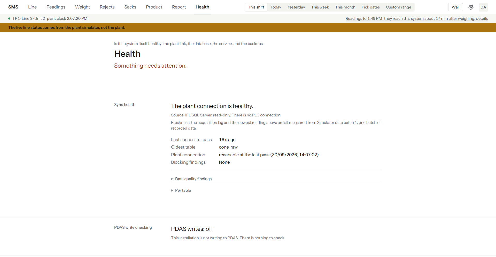

# Verification checklist {#verification}

Work through this list after installation (Chapter 4) and after any
significant change — a service restart, a Windows update, a new source
generation accepted. Tick each item off only once you have actually seen it,
not because the step before it passed.

- [ ] `GET /api/health` returns `"status": "ok"`, or a `"degraded"` status
  with a stated reason you recognise from {{ref:troubleshooting}}.
- [ ] [[Health]] shows [[Everything is healthy.]] as its headline — see
  the figure below.

- [ ] The sync block on [[Health]] shows a healthy outcome for every source
  table, not [[The last sync attempt failed.]] or
  [[The plant connection has not delivered anything recently.]]

- [ ] `node cli/dist/index.js verify` exits clean: no `STOP` line, no weight
  mismatch.
- [ ] `node cli/dist/index.js epoch:list` shows the generation you accepted
  in {{ref:install-first-connection}}, with row counts that are growing on
  a re-run a few minutes later.
- [ ] The Backups block on [[Health]] says the newest backup has been
  proven restorable ([[This backup has been proven restorable — RESTORE VERIFYONLY passed and its size still matches.]]),
  not [[This backup has not been proven restorable. Do not rely on it until it verifies.]]
- [ ] The [[Disk space]] block on [[Health]] shows plenty free on both the
  database volume and the backup volume (SMS warns below 2 GB).
- [ ] The Database block on [[Health]] shows a size comfortably under the
  10 GB SQL Server Express cap (see Appendix C, item 10).
- [ ] The Backups block on [[Health]] shows a recent backup, once the first
  scheduled backup has run (see {{ref:install-scheduled-tasks}} and Chapter 9).
- [ ] Signing in as the first admin account works, and [[Setup]] is
  reachable (admin only — every other screen should also be reachable by
  every account you created).
- [ ] The [[Sign out]] menu item ends the session and returns to the sign-in
  form.
- [ ] `SMS-Api` and `SMS-Sync` (or whatever names NSSM was given) both show
  as running services, and restart on their own if stopped (test this
  deliberately once, in a maintenance window).
- [ ] The firewall rule from {{ref:install-firewall}} allows a browser on
  another PC on the plant network to reach SMS.

If any box cannot be ticked, do not consider the installation complete —
work through {{ref:troubleshooting}} for that symptom before moving on.
