# Configuration {#configuration}

## The `.env` keys that matter {#env-keys}

The full list of every key SMS reads is in Appendix A. The keys below are
the ones most likely to need attention after the first install, or to be
gotten wrong.

| Key | Why it matters |
|---|---|
| `COOKIE_SECURE` | Must be `true` once SMS is served over HTTPS (the normal plant setup); set to `false` only on a plain-HTTP link such as a demonstration system — leaving it `true` on a plain-HTTP link means nobody can sign in, because the browser will not send the session cookie back. |
| `PLANT_UTC_OFFSET_MINUTES` | The plant's declared UTC offset, in minutes (UTC+5 = 300). Used for the two-clocks cross-check described in {{ref:two-clocks}} — get this wrong and Health may report a clock mismatch that is not real. |
| `LINE_ID` | Which line this installation serves. Immutable once data has been ingested against it — decide it once, correctly, before the first sync. |
| `BACKUP_DIR` | Where [[Health]]'s Backups block looks for the newest `.bak` file — it must match the `-OutDir`/`-BackupDir` value the backup scripts and scheduled tasks actually use, or Health will report no backup found even though one exists. |
| `WEB_DIST` | Set this (to `./web/dist`) so the API also serves the built web app itself — the normal single-process production setup described throughout this guide. |
| `PDAS_WRITE_ENABLED` | Master switch for the PDAS write path — see {{ref:pdas-writes}}. Off by default, and should stay off until the conditions in that section are met. |
| `PDAS_LIMIT_MAX_SETPOINT_CHANGE_PCT`, `PDAS_LIMIT_MAX_OFFSET_CHANGE_G` | The size of a limits change (default 3 % and 20 g) above which an engineer must confirm and give a longer reason. These are the developer's defaults, not IFL's; see {{ref:pdas-writes}}. |
| `LIVE_ALLOW_SIMULATOR` | Development only; never set at IFL. It lets the live screens follow the plant simulator. The API ignores it unless the database name ends in `_SIM` and the server is local. |
| `WEIGHT_BASIS`, `SHIFT_MODE` | Not yet confirmed by IFL for this plant (see Appendix C, item 12) — leave at their defaults (`as_recorded`, `corrected`) unless IFL has given a written answer. |

## Setup page {#setup-page}

[[Setup]] is reached from the gear icon at the right of the top bar and is
open only to `admin` accounts. It is one long page, not a set of tabs — each
block below is a section of that same page.

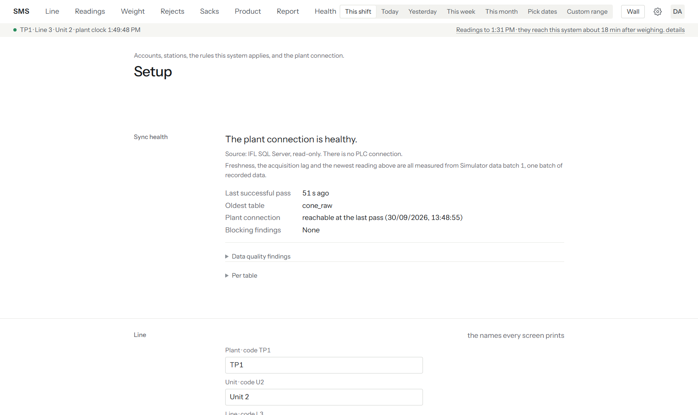

- [[Sync health]] — the same per-table sync outcome shown on [[Health]],
  with more detail: the current watermark and the registered generation for
  each source table.

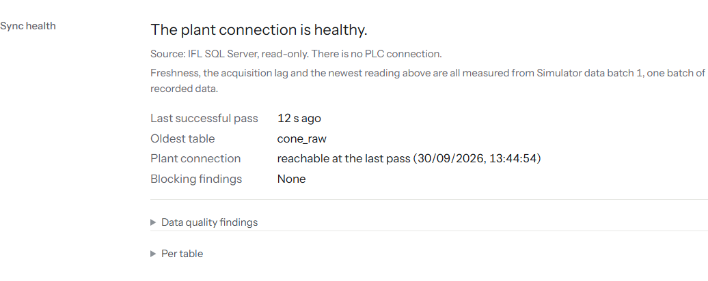

- [[Line]] — the line's own display name and identifying details.

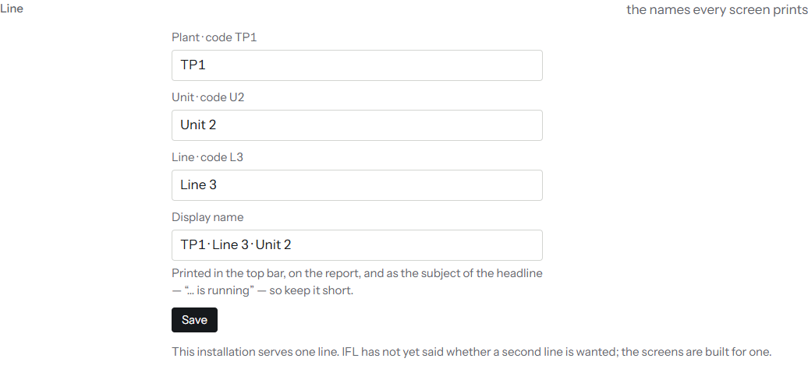

- [[Machines]] — the roster of physical machines on the line. New ones
  are added with the [[Add a machine]] form (machine number, kind, name,
  make, model, notes).

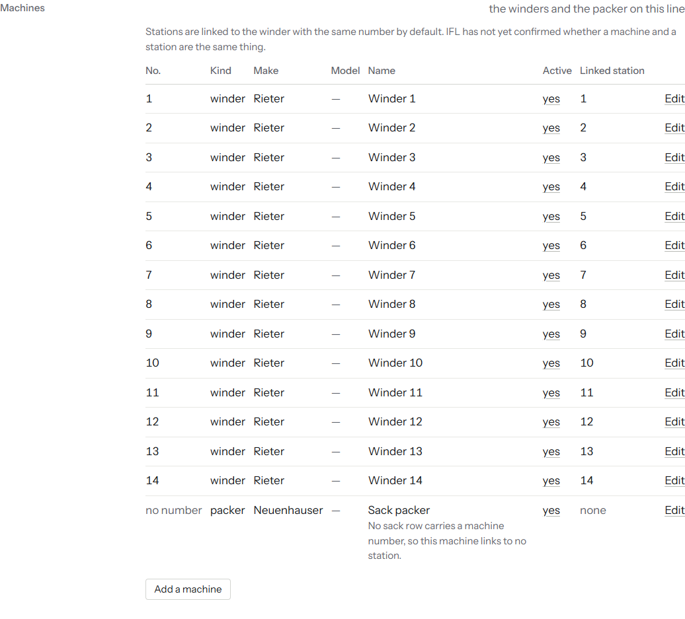

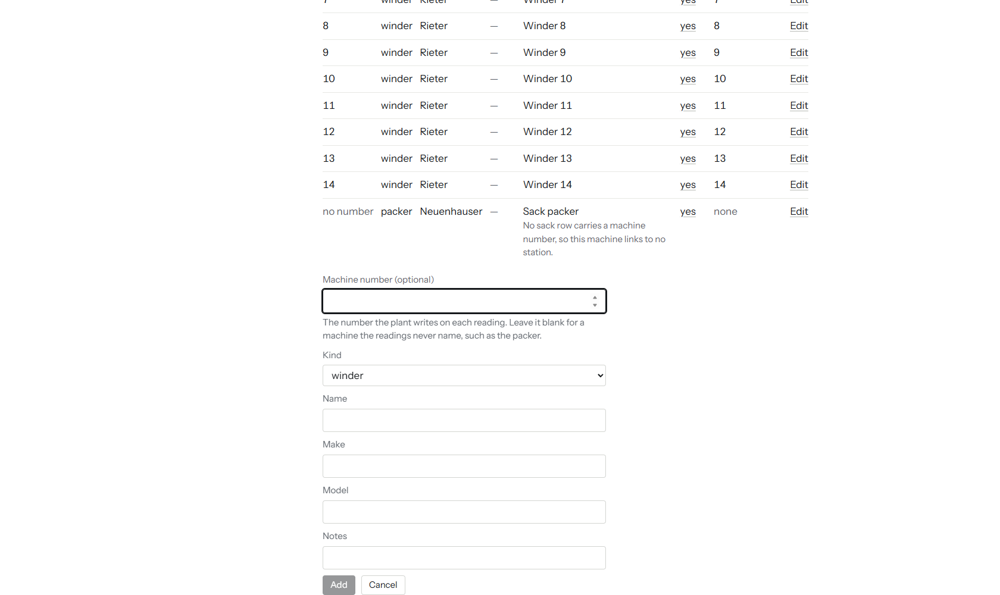

- [[Stations]] — the roster of weighing stations, each optionally linked
  to a machine. New ones are added with the [[Add a station]] form (station
  number, optional name).

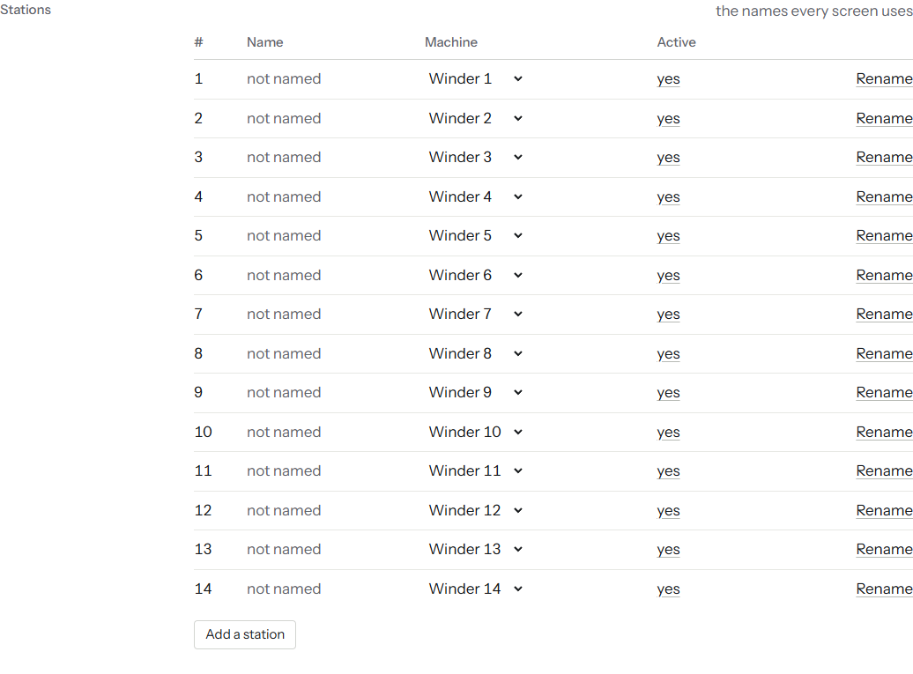

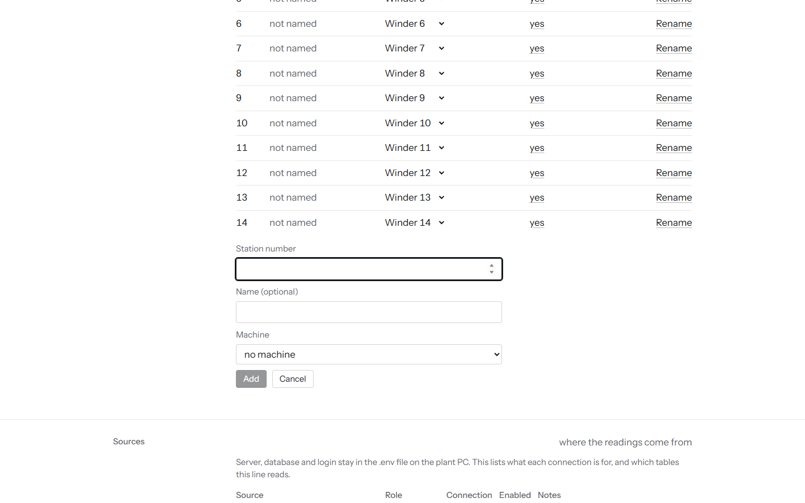

- [[Sources]] — which source tables and generations feed this line.

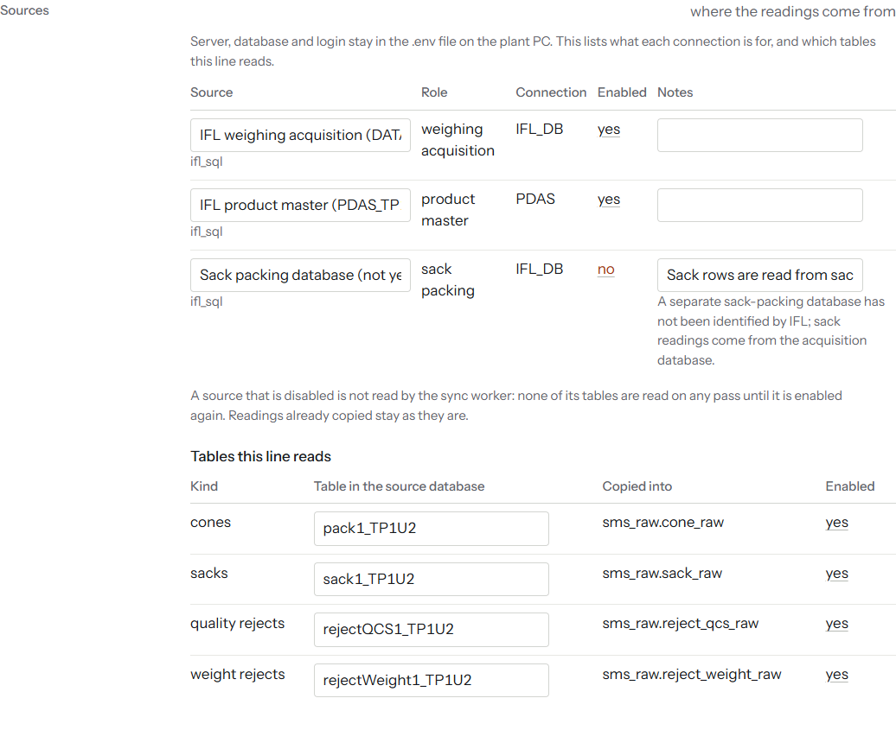

- [[Rules]] — the shift, weight and plausibility rules in force, and
  when they changed.

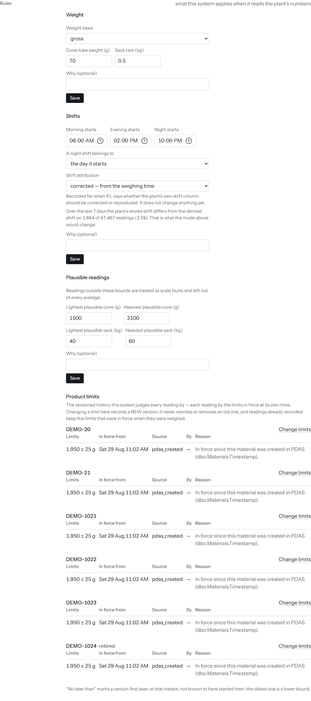

- [[Reject codes]] — every reject code with its type, tube code and
  material code, a Name box (the name applies to every reading, past and
  future), and Pass? and Severity choices. A code can also be named from
  the [[Rejects]] screen itself.

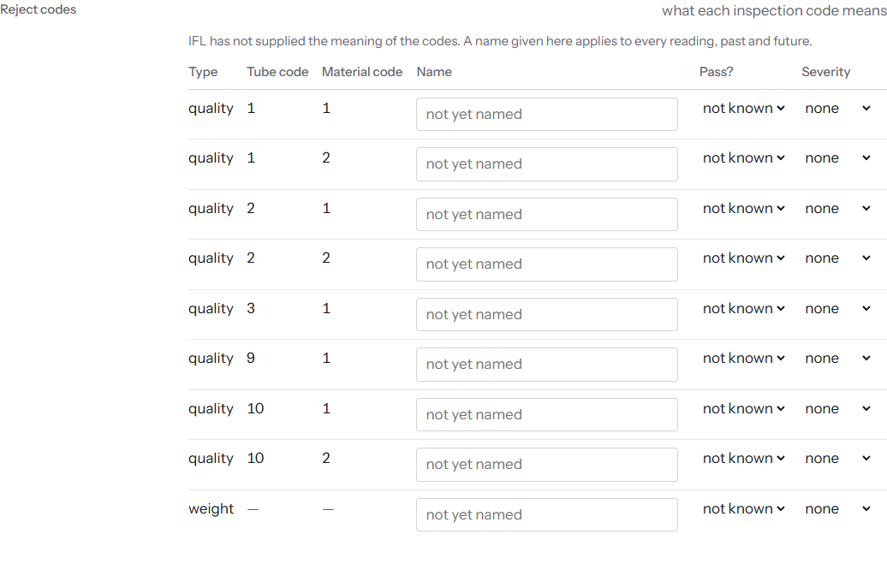

- [[People]] — accounts. New ones are created with the [[New account]]
  form ([[Username]], [[Display name (optional)]], [[Password]], [[Role]]);
  an existing account's password can be [[Reset]] from the same block. See
  {{ref:roles-table}} for what each role can do.

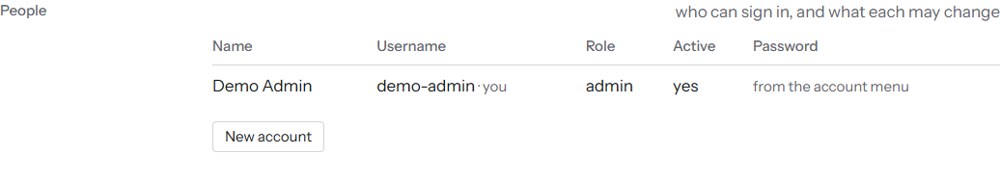

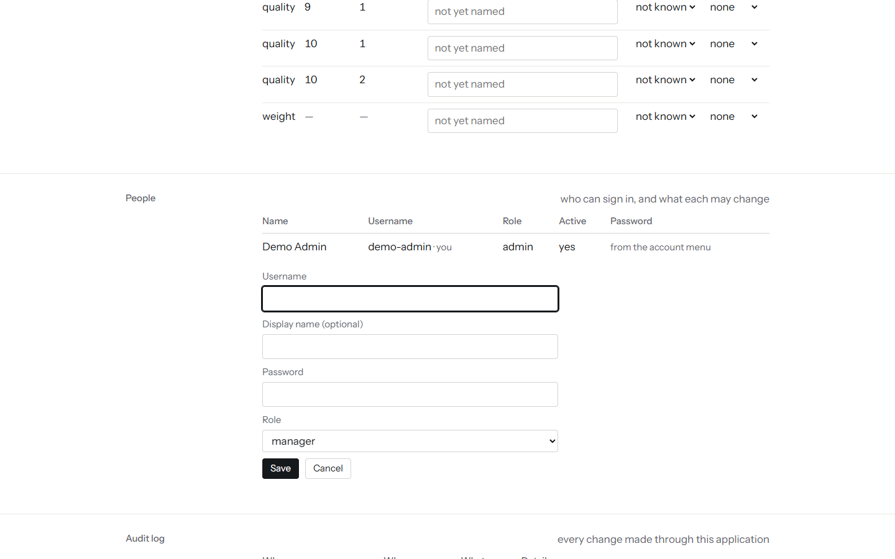

- [[Audit log]] — every write SMS itself has made: account changes,
  calibration adjustments, product changes, and PDAS write attempts.

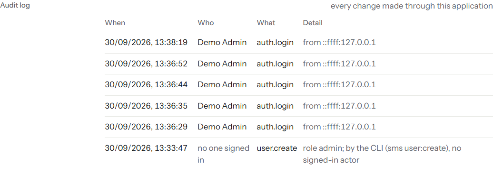

## Roles and what each can do {#roles-table}

Every screen described in Chapter 7 is open to every signed-in account, at
every rank — [[Setup]] is the only screen restricted, to `admin`. Roles
govern writing, not reading:

| Role | Rank | Can additionally do |
|---|---|---|
| `viewer` | 1 | Read every screen. Cannot write anything. |
| `engineer` | 2 | Set the running product, log a calibration adjustment, name a reject code, record a sack movement, set local product limits, acknowledge a known data finding on [[Health]]. |
| `manager` | 3 | Everything `engineer` can, plus export a report or the raw register. |
| `admin` | 4 | Everything `manager` can, plus everything in [[Setup]]: accounts, machines, stations, rules. |

> **Note:** PDAS writes (creating or retiring a product, changing limits in
> PDAS, executing a changeover) require rank 2 (`engineer`) and
> `PDAS_WRITE_ENABLED=true` — see {{ref:pdas-writes}}. Rank alone does not
> turn this on.

## PDAS writes: what they are, why they are off, what enabling them requires {#pdas-writes}

SMS can, in principle, write to IFL's product-master database (`PDAS_TP1U2`)
through the same stored procedures IFL's own PDAS client uses — creating or
retiring a material, adding a blend/count/tube type, creating or retiring a
pallet, and changing a material's weight limits. This is a **separate path**
from the read-only connection used for everything else in this guide: it
uses its own login (`PDAS_WRITE_USER`, the documented generic name is
`sms_pdas_writer`), never the read-only login.

**Why it is off.** `PDAS_WRITE_ENABLED=false` is the default, and stays
`false` until all of the following are true:

- IFL has given written authority for SMS to write to PDAS.
- A separate `sms_pdas_writer` login has been provisioned on the plant's
  own PDAS server (`PDAS_WRITE_SERVER`/`PORT`/`DATABASE`/`USER`/`PASSWORD`
  in Appendix A) — distinct from the read-only login.
- The write path has been proven end to end against a non-production copy
  first.

**What a limits change asks for.** Changing a product's limits is a two-step
form: a review step that shows each old and new value with the change in
grams and per cent, then a write step. A change that moves the target by
more than 3 % or a limit by more than 20 g is called out as a large change
and needs a tick in the box and a reason of at least 20 characters. Those
two figures are the developer's own choice, not IFL's, and can be changed
in `.env`. On Product › Catalogue the block [[Pallets in PDAS]] lists every
pallet with a Retire or Reactivate button, gated the same way as products.
Who at IFL may make these changes, and how a changed limit reaches the
machine, are still open questions; SMS does not claim to know.

**What it looks like while off.** Product › Changeover's [[Check the plan]]
button still works — it is a read-only dry run that never opens the PDAS
writer connection. Its [[Execute the changeover]] button is disabled, and
the screen states why, in the server's own words:
[[PDAS_WRITE_ENABLED is not true.]]
[[Health]]'s PDAS write block reads [[PDAS writes: off]] with the body text
[[This installation is not writing to PDAS. There is nothing to check.]]

**What enabling it requires.** Set `PDAS_WRITE_ENABLED=true` and fill in the
`PDAS_WRITE_*` connection keys in `.env`, once every condition above is met.
Every write made through this path is checked: read back from PDAS
immediately afterward, with any mismatch raised as a finding rather than
assumed to have succeeded. A changeover executed this way still only makes a
product selectable in PDAS — it does not, by itself, put that product on a
machine; whether the machine's own controller reads its limits from PDAS
live is a separate question for IFL.

## Optional TLS {#tls}

SMS can terminate TLS itself rather than sit behind IIS or another reverse
proxy, using `TLS_CERT_PATH`/`TLS_KEY_PATH` (a certificate and key file
pair) or `TLS_PFX_PATH`/`TLS_PFX_PASSPHRASE` (a combined PFX file). Leave
all four unset to serve plain HTTP — reasonable on an isolated plant LAN,
but then `COOKIE_SECURE` must be `false` (see {{ref:env-keys}}) or nobody
will be able to stay signed in.
