# Daily use {#daily-use}

This chapter walks through every screen a signed-in person uses. Each
section says what the screen is for, shows it, lists the steps for the usual
jobs, and explains what each part of the screen means.

> **Note:** Every screenshot in this chapter was taken from a demonstration
> copy of SMS fed by the plant simulator, not by IFL's plant. The numbers,
> product names (DEMO-20, DEMO-21 and so on) and the single "Demo Admin"
> account are therefore made up. A yellow banner across the top of the screen
> says so whenever the figures come from the simulator; at IFL that banner
> does not appear. Your own screens will show your own numbers, but the
> layout and wording are the same.

Every screen is open to every signed-in account; only [[Setup]] is limited to
administrators (see {{ref:roles-table}}). What differs by role is who may
change things: recording the running product, logging a calibration
adjustment or naming a reject code needs the engineer role or above, and
exporting a report needs manager or above.

## Signing in, the top bar and the period {#signin}

Open the SMS address in a browser. The first thing you see is the sign-in
form.

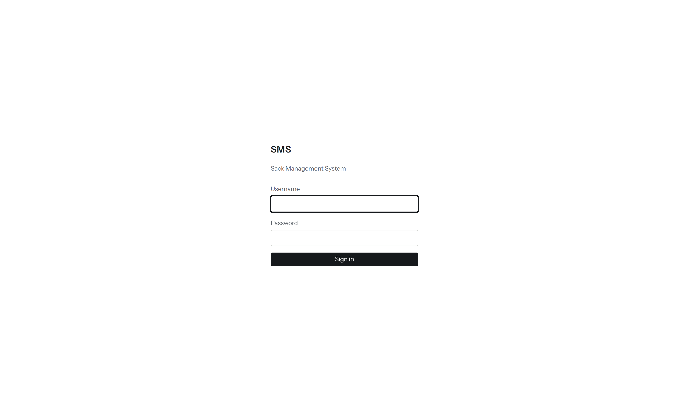

1. Type your username in [[Username]].
1. Type your password in [[Password]].
1. Press [[Sign in]].

If the details are wrong SMS says [[That username and password did not match.]]
and after several wrong attempts it makes you wait a few minutes before
trying again. It never says which of the two was wrong.

Once you are in, every screen shares the same bar along the top.

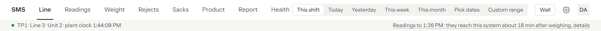

| Part | What it tells you |
|---|---|
| [[SMS]] and the screen names | Click a name to move to that screen: [[Line]], [[Readings]], [[Weight]], [[Rejects]], [[Sacks]], [[Product]], [[Report]] and [[Health]]. The current one is underlined. |
| Period buttons ([[This shift]], [[Today]], [[Yesterday]], [[This week]], [[This month]], [[Pick dates]], Custom range) | The stretch of time every screen is describing. It applies to the whole application at once: change it here and each screen follows. |
| [[Wall]] | Opens the fullscreen wall display (see {{ref:wall}}). |
| Gear icon | Opens [[Setup]]. Only administrators see it. |
| Initials button (here "DA") | Opens the account menu described below. |
| [[plant clock]] | The time at the plant, not the time on your PC. All SMS times use the plant's clock. |
| The sentence on the right, ending in [[details]] | How fresh the data is. Readings reach SMS about 18 minutes after the cone is weighed, so this sentence names the time of the newest reading and the delay. If it warns that nothing has arrived, the plant link may be down and no screen should be read as "the line is running". |

To look at a stretch of time that is not a shift, day, week or month, press
[[Pick dates]]. Two date boxes appear where the period buttons were.

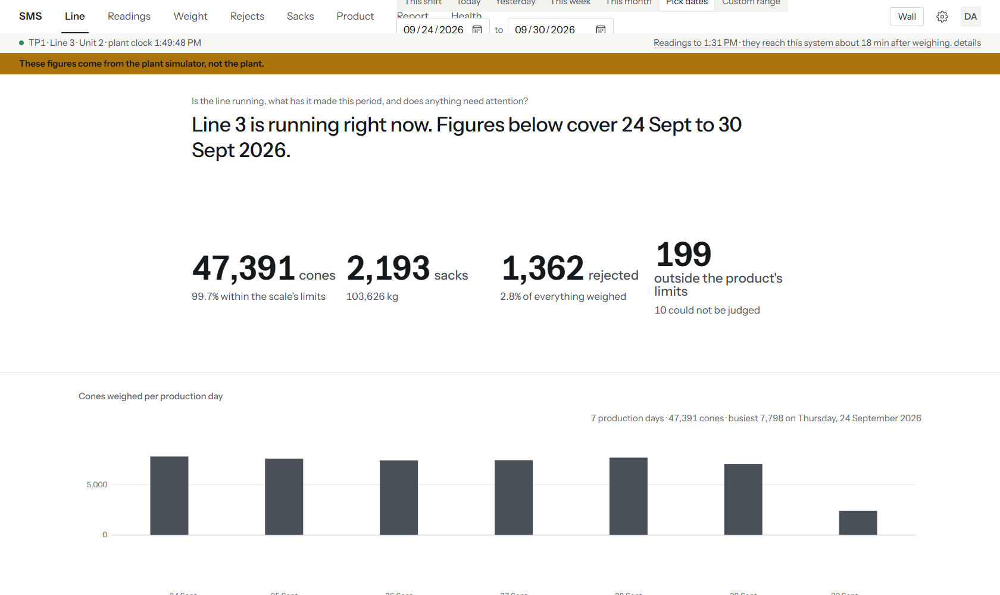

> **Note:** In the current release the date boxes are drawn over the top bar
> and can hide the [[Report]] and [[Health]] names while they are open, as the
> figure shows. Choose the dates, then press a screen name once the boxes
> have closed.

1. Press [[Pick dates]].
1. Enter the first and last day in the boxes.
1. Read the screen; it now covers those days.

The initials button at the right of the bar opens the account menu.

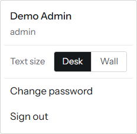

- [[Text size]] switches between [[Desk]] (normal) and [[Wall]] (larger, for
  a screen read from a distance).
- [[Change password]] opens a small form.
- [[Sign out]] ends the session.

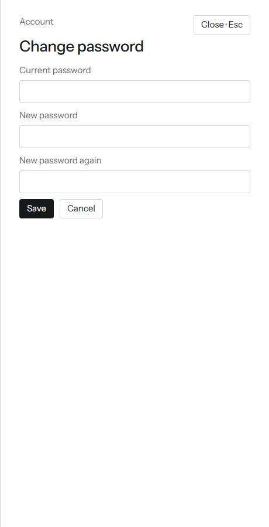

To change your own password:

1. Open the account menu and choose [[Change password]].
1. Type the current password, then the new one twice.
1. Press [[Save]]. Press **Cancel**, or the Esc key, to leave without saving.

An administrator can also reset another person's password from [[Setup]]; see
{{ref:roles-table}} and Chapter 10.

## Line: is it running right now? {#line}

Line is the screen SMS opens on. It answers one question: is the line
running, what has it made this period, and does anything need attention?

1. Press [[Line]] in the top bar.
1. Choose a period. [[This shift]] shows the current shift so far.
1. Read the headline first. It says whether the line is running, stopped or
   idle, and how far into the shift it is.
1. Look at the Attention block. If it lists something, press [[See them]].
1. To see which product each machine is making, read "What is being made".

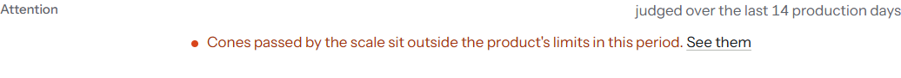

| Part | What it tells you |
|---|---|
| Headline ("Line 3 is running — 7 h 44 min into the morning shift…") | Whether the line is running, based on when the newest reading arrived, corrected for the 18-minute delay. When the data link is unhealthy the headline refuses to say. |
| The four big figures | Cones weighed and the share within the scale's limits; sacks and their weight; cones rejected; and cones the scale passed that sit outside the product's own limits. |
| Cones weighed per shift | A shape comparison between shifts. With only one shift in the period it says so, as in the figure; choose [[This week]] to see it. |
| [[Attention]] | Things that need a person to look: cones outside product limits, a station reading consistently heavy or light, a rising reject rate. It always looks back 14 production days, whatever period you chose. |
| Stations bars | One bar per station: cones this period against the middle station. A station with many rejects shows its count underneath. The demo's station 7 has 38 rejected. |
| What is being made | The product each machine is running now, and for how long at least. It is anchored on the newest reading, not on your chosen period. The Change and History buttons open the [[Product]] screen. |
| Last readings | The most recent sack and cone. Click either to open its record. |

## Readings: every cone and every sack {#readings}

Readings is the register. It lists each cone or sack that was weighed, newest
first, so you can look up one reading or scan a stretch of them.

1. Press [[Readings]].
1. Choose the list with the buttons under the headline: [[Cones]], [[Sacks]],
   [[Rejected cones]] or [[Rejected by inspection]].
1. Narrow the cones list with the [[Station]] box and the State buttons.
1. Press any row to open its record.
1. Use Next and Previous at the foot of the list to page through it.

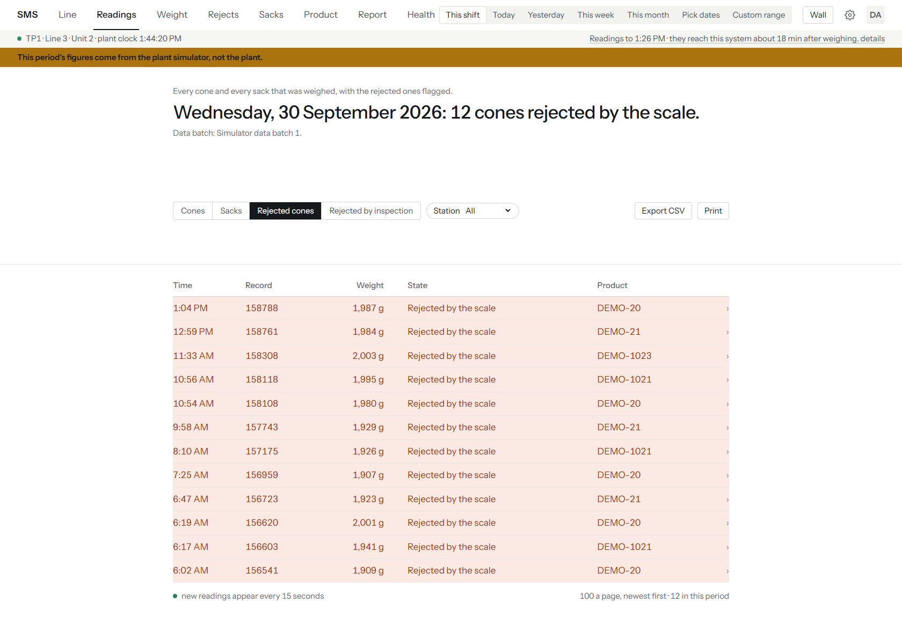

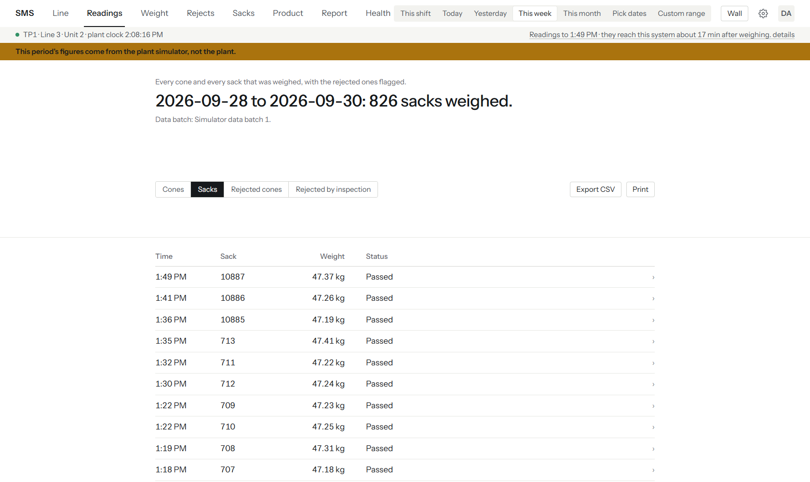

| Part | What it tells you |
|---|---|
| Headline | How many were weighed and how many the scale rejected in the period. |
| Data batch line | Which batch of source data this period comes from. On the demo it reads "Simulator data batch 1". |
| State column | The scale's own verdict: Within limits, or Rejected by the scale. A second fact, "outside the product's limits", appears only where a product was recorded for that reading. |
| [[Export CSV]] | Downloads the list you are looking at as a spreadsheet file (manager or above). |
| [[Print]] | Prints the list with the line, period and time it was produced in the page header. |
| "new readings appear every 15 seconds" | The list refreshes itself while you look at it. |

Press a cone, sack or rejected row to open its record.

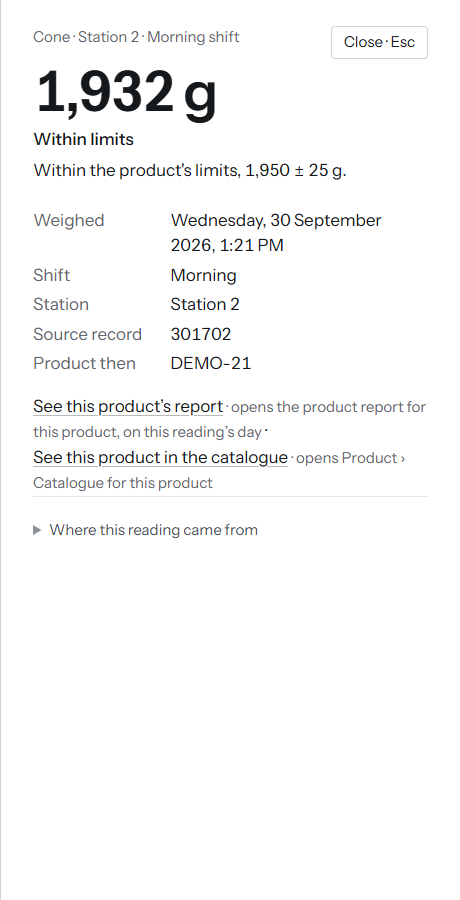

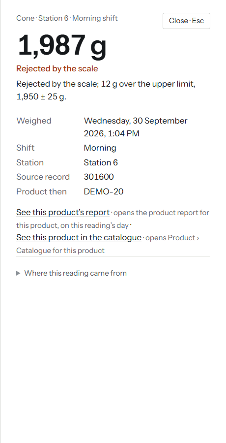

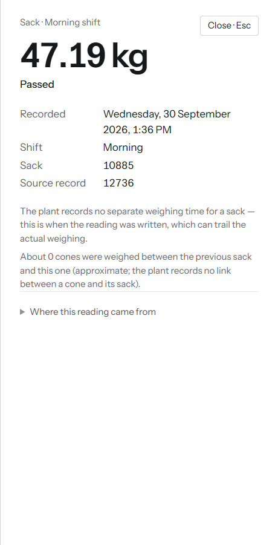

Press the **Close** button or the Esc key to go back to the list. Note that the sack
record says the time is when the plant wrote the reading, which can trail
the actual weighing, and that the "cones weighed between this sack and the
previous one" figure is an estimate; SMS does not know which cones went into
which sack.

## Weight: are the cones the right weight? {#weight}

Weight answers whether cones are at the right weight and whether any
station's scale needs attention.

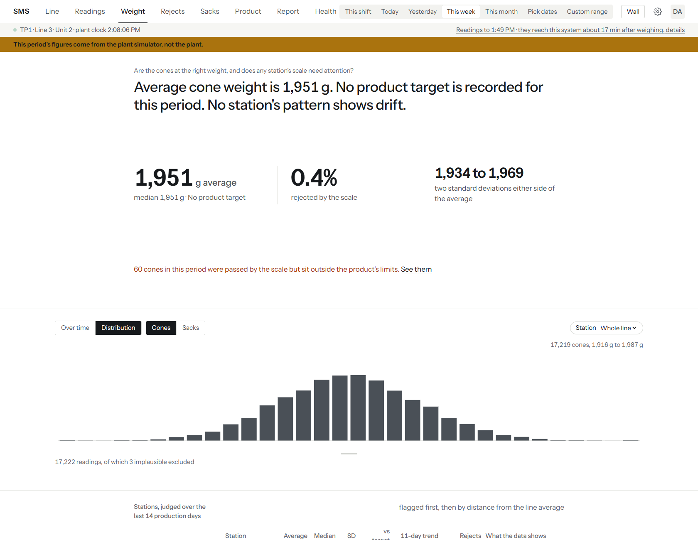

> **Note:** The demo has no product target recorded for the line as a whole,
> so this screenshot has no target or limit lines on the chart and the
> headline says so. On a real installation with a running product recorded
> you will see them.

1. Press [[Weight]] and choose a period.
1. Read the headline: the average cone weight and, where a target exists,
   how it compares.
1. Use the buttons above the chart to switch between [[Over time]] and
   [[Distribution]], and between [[Cones]] and [[Sacks]].
1. Use the [[Station]] box to look at one station instead of the whole line.
1. Press a station's name in the table to open its record.

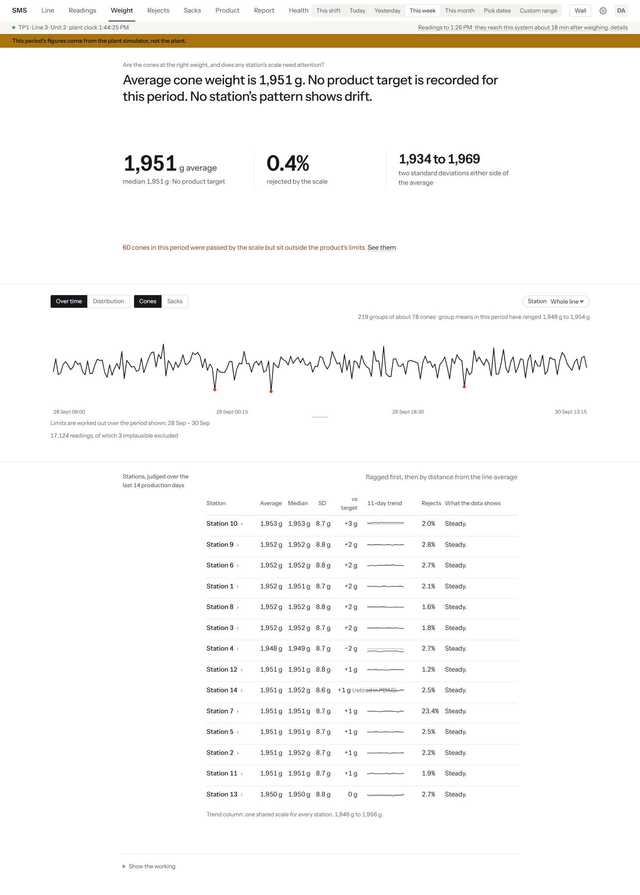

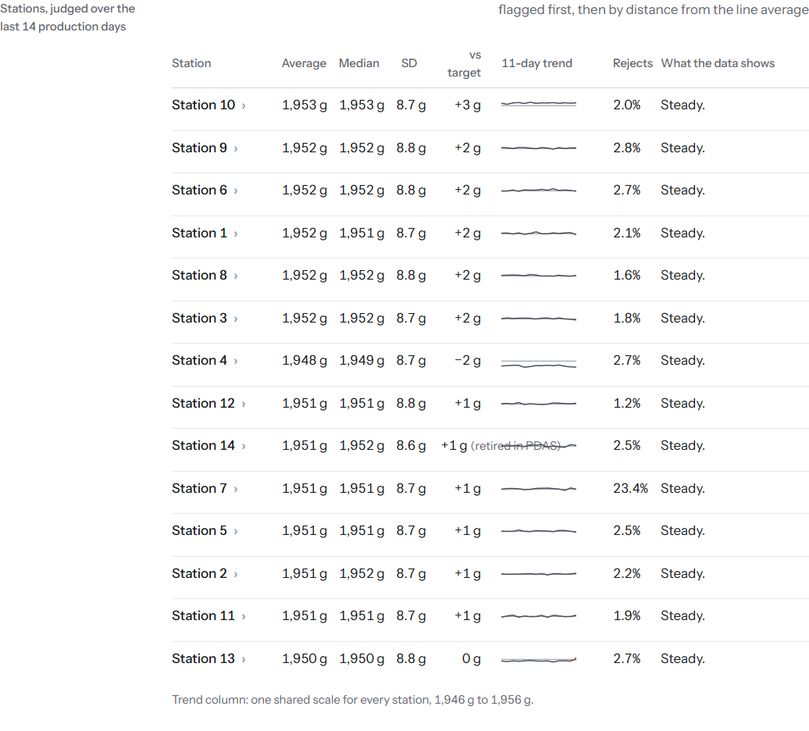

| Part | What it tells you |
|---|---|
| Average, "rejected by the scale" and "two standard deviations either side" | The centre, the share the scale rejected, and the normal spread of cone weights. |
| Distribution chart | How many cones fell at each weight. A single bell is healthy; two bumps or a long tail suggest a problem. |
| Over time chart | The average weight of consecutive groups of cones. Red points are groups that fell outside the usual range. |
| Station table | One row per station. "vs target" shows how far the station's average is from the target in force. The trend column uses one shared scale so stations compare fairly. The last column says Steady unless a drift pattern has held for several days. |
| Judged over the last 14 production days | The table always looks back 14 days, whatever period you chose, because a drift needs consecutive days to show. |

Press a station to see its detail.

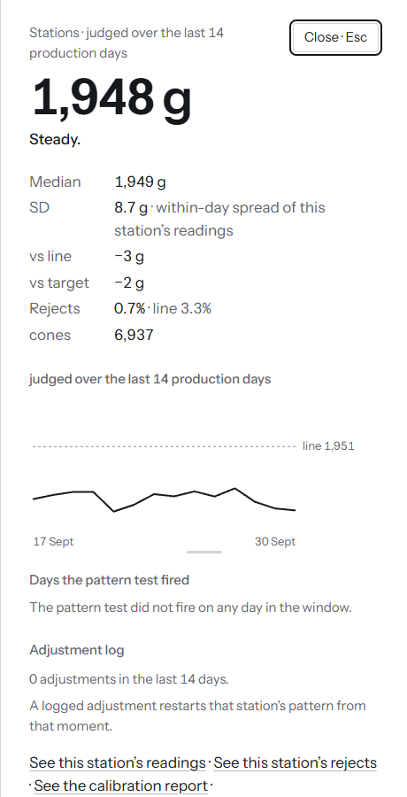

An engineer or above can log that a scale was adjusted, so later readings
are judged from that moment on. Scroll to the bottom of the station's record.

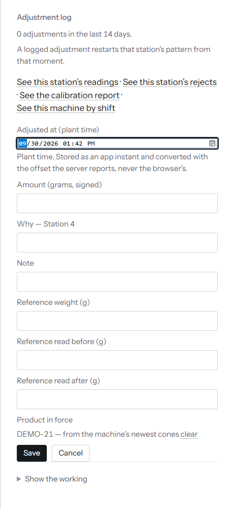

1. Open the station from the table.
1. Fill in when it was adjusted (plant time), the amount in grams and the reason.
1. Press [[Save]]. An adjustment cannot be edited afterwards; a correction is a new entry.

The weighing data cannot tell a heavy scale from heavy cones, so SMS never
says which way to adjust a station.

## Rejects: why are cones being rejected? {#rejects}

Rejects answers how many cones are rejected, for what reason, whether it is
getting worse, and where.

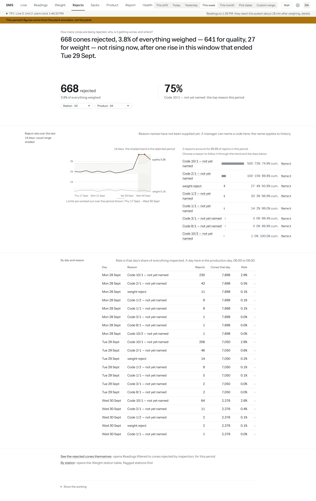

1. Press [[Rejects]] and choose a period.
1. Use [[Station]] and [[Product]] boxes to narrow the picture.
1. Press a reason in the reasons list to follow it through the trend and days.
1. Press the same reason again, or the small x on its chip, to clear it.
1. To give a reason a name, see below.

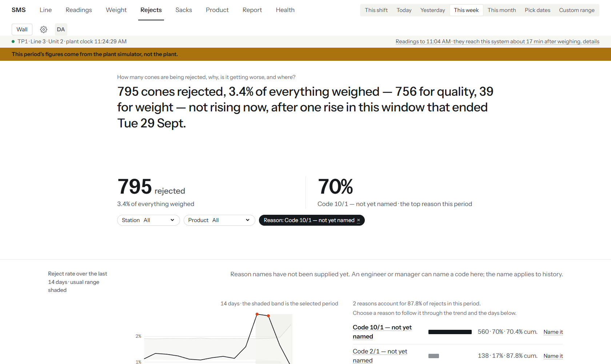

| Part | What it tells you |
|---|---|
| Headline | Total rejected, the share of everything weighed, the split between quality and weight rejects, and whether the rate is rising. |
| Reject rate over the last 14 days | The line is the reject rate; the shaded band is the usual range; the darker band marks your chosen period. |
| Reasons list | Each reason with its count, share and running total. Two reasons make up about 90% of rejects in the demo. |
| By day and reason | Each production day (06:00 to 06:00) and reason with its rate. |
| See the rejected cones themselves | Opens Readings filtered to the rejected cones for this period. |

The plant supplies only numeric codes such as "Code 10/1"; IFL has not yet
said what they mean. An engineer or above can type a name for a code and it
applies to all past and future readings. (The note on the Rejects screen says
"A manager can name a code here"; the server allows engineers too.)

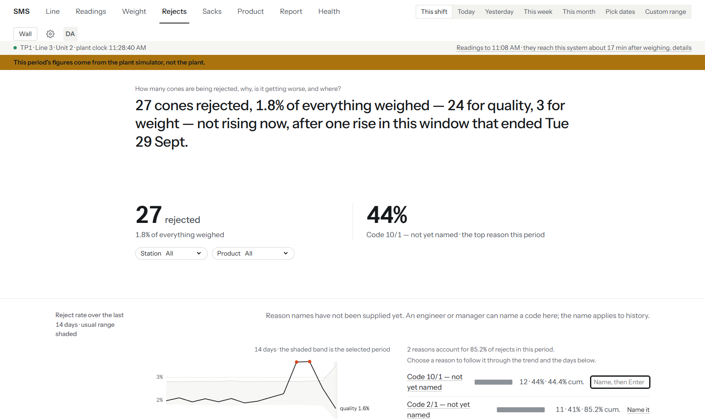

1. Find the reason in the list and press [[Name it]].
1. Type the name and confirm it.

## Sacks: how many sacks and what is in stock {#sacks}

Sacks reports on sacks weighed, their weight, and a running line stock.

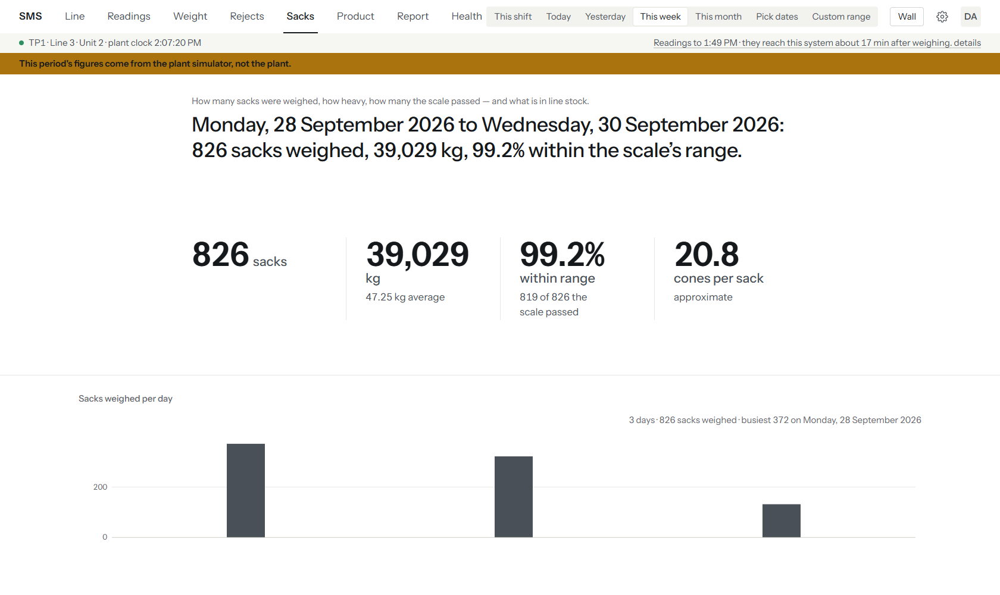

1. Press [[Sacks]] and choose a period.
1. Read the headline and the four figures.
1. Scroll to By shift to compare Morning, Evening and Night.
1. Scroll to Stock ledger for the line's stock, opening and closing per day.
1. Press any row of the Sack history to open the sack's record.

| Part | What it tells you |
|---|---|
| "cones per sack, approximate" | An estimate only; the plant records no link between a cone and its sack. |
| By product | Sacks grouped by product. On the demo all sacks say "No product on the reading", because sack readings carry no product. |
| Stock ledger | Opening stock, receipts (each sack weighed counts as a receipt), issues, consumption, adjustments and closing. It is stock for the whole line, never per machine: the plant's sack records carry no machine. |

Press a day in the ledger to see that day's movements.

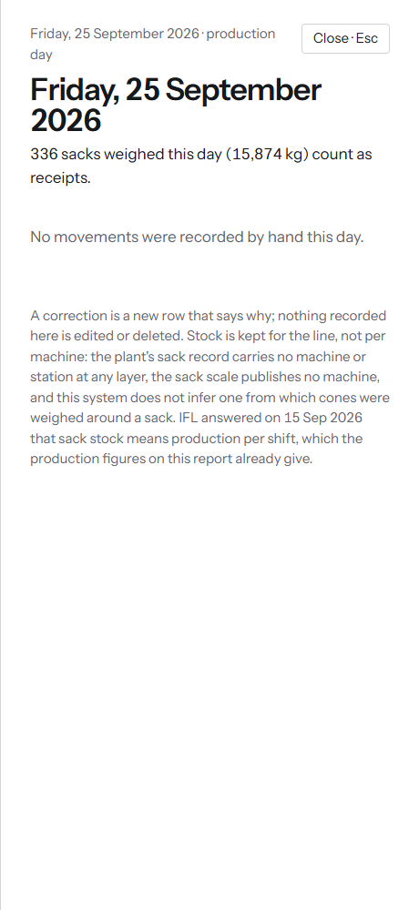

An engineer or above can record a movement made by hand, such as sacks issued.

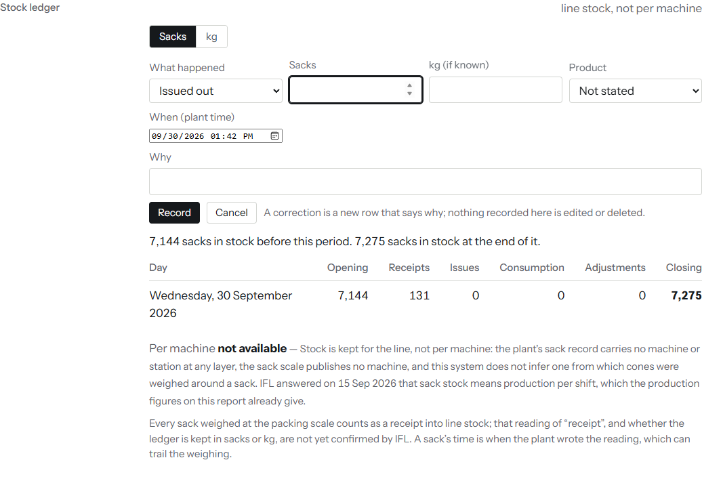

1. Press [[Record a movement]] in the Stock ledger.
1. Choose what happened, and enter the sacks (or kg), the plant time and a reason.
1. Press [[Record]]. Nothing recorded can be edited or deleted; a correction is a new row that says why.

## Product: what is running, and how to change it {#product}

Product has four tabs: [[Running]], [[Changeover]], [[Catalogue]] and [[History]].

### Running

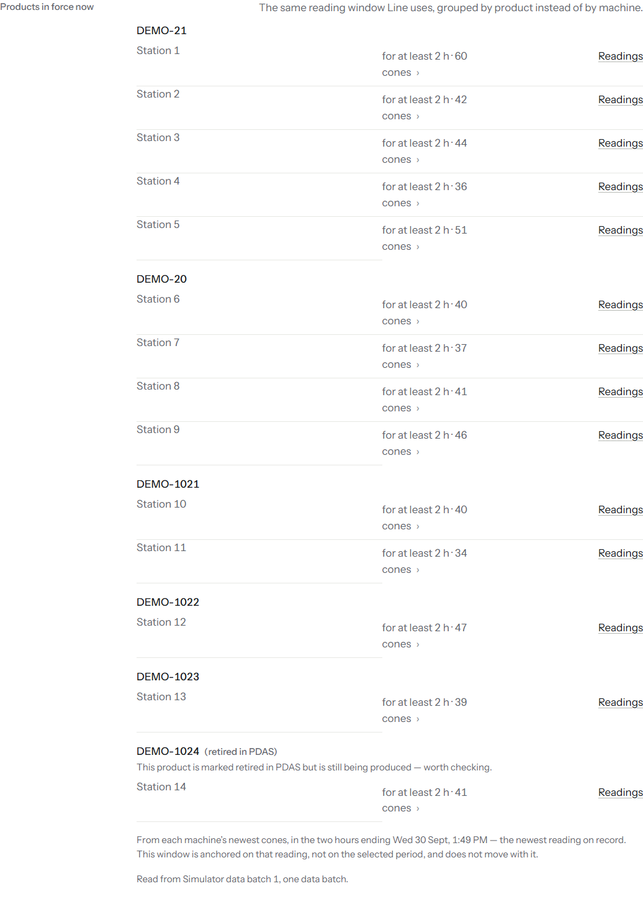

The tab lists each product currently being made and the stations making it,
using the same readings as Line. A product marked "(retired in PDAS)" that is
still being produced deserves a check: someone retired it in the product
database but a station still runs it.

To record the line's product in SMS (engineer or above):

1. On the Running tab, press [[Change]].
1. Pick the product and give a reason if you wish.
1. Press **Record this product**.

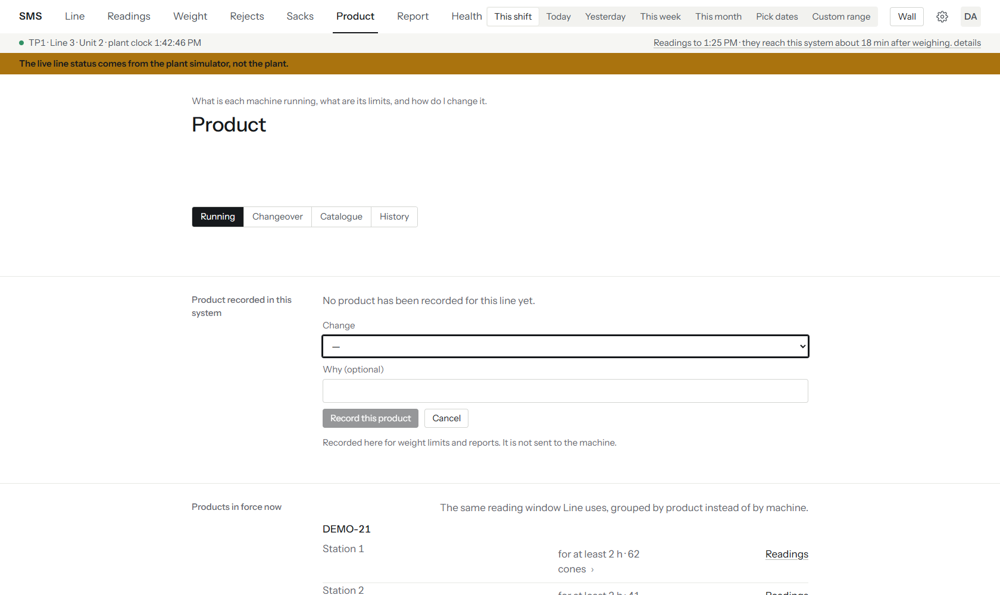

This records the product in SMS for weight limits and reports only. It is
not sent to the machine.

### Changeover

The Changeover tab plans a product change and checks it for problems before
anything is written.

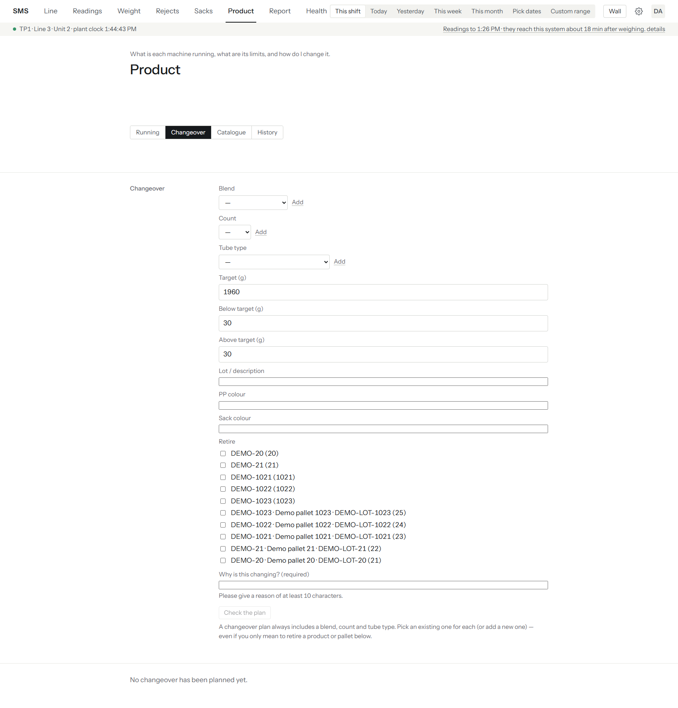

1. Pick an existing blend, count and tube type, or press the **Add** link beside one to
   create a new one.
1. Set the target weight and the amounts below and above it, and type a
   lot / description (the plan is blocked without one).
1. Tick anything to retire, and type the reason (at least 10 characters).
1. Press [[Check the plan]].
1. Read the plan and any Blockers.

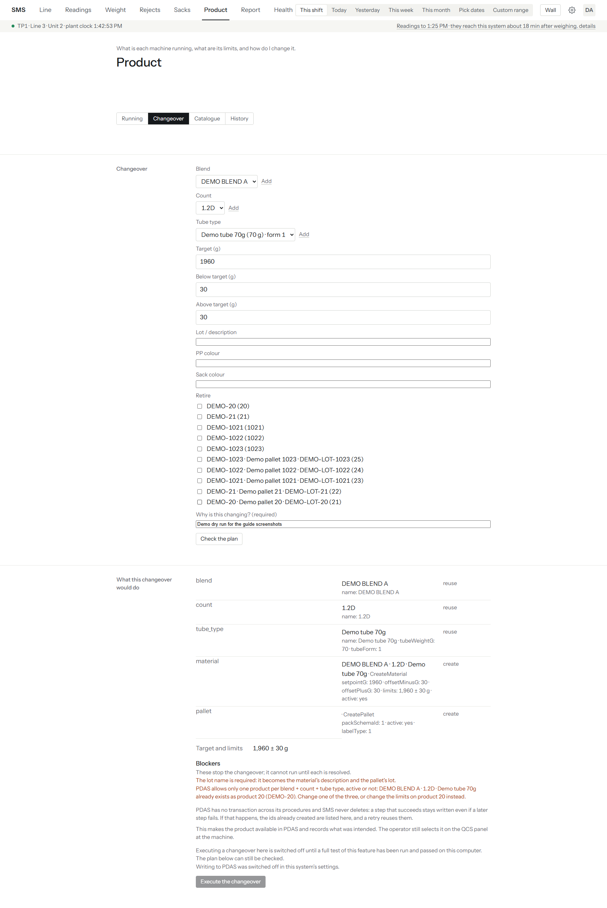

The plan lists each step (re-use or create) and lists **Blockers** in red.
Here the blocker says PDAS allows only one product per blend, count and tube
type, so this plan cannot run; the fix it suggests is to change the limits of
the existing product instead.

> **Warning:** Executing a changeover is switched off in this release. The
> button [[Execute the changeover]] stays greyed and the screen says why:
> writing to PDAS is disabled until a full test has passed on the plant PC.
> The plan can still be checked as often as you like; checking never writes
> anything. See {{ref:pdas-writes}} for the conditions for turning writes on.
> Also, retiring a product and creating it again with the same blend, count
> and tube type cannot work, by PDAS's own design; change the limits of the
> existing product instead.

### Catalogue

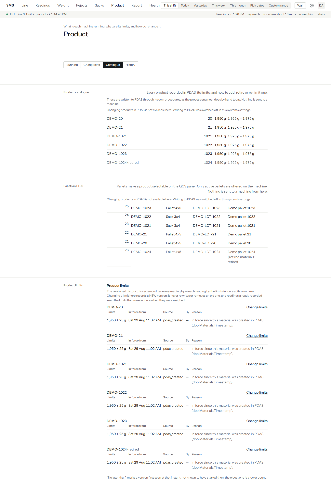

The tab shows products, pallets and each product's limits history. Every
reading is judged by the limits in force when it was weighed, so changing a
limit adds a new version and never rewrites the old ones. To change a limit
in SMS (engineer or above):

1. Press **Change limits** beside the product.
1. Enter the target and the amounts below and above it, and a reason.
1. Press [[Save]].

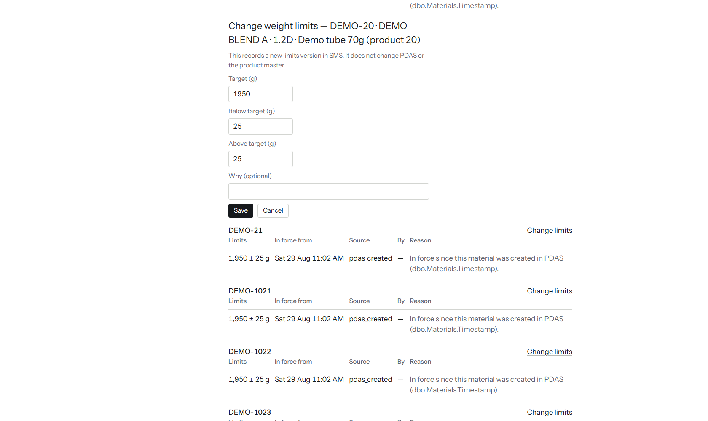

The form says this records a new limits version in SMS and does not change
PDAS or the product master.

### History

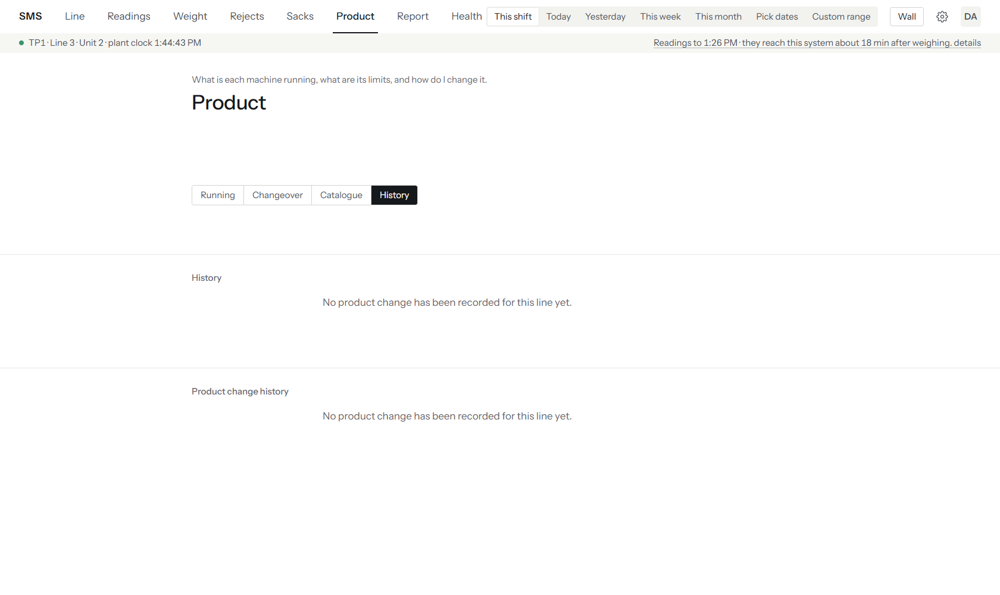

The trail of product changes made through SMS. On the demo none has been
made, so both blocks are empty.

## Report: printable and exportable reports {#report}

Report produces the reports IFL asked for, for the period in the top bar.

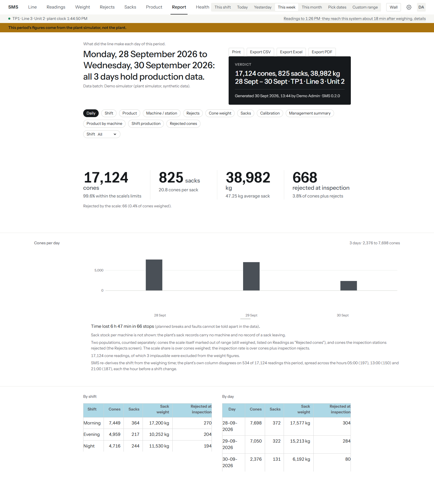

1. Press [[Report]] and choose a period.
1. Choose the report type from the row of buttons under the verdict.
1. Use the extra boxes that appear for some types (Shift, Station) to narrow it.
1. Press [[Print]] to print, or one of the Export buttons to download.

The report types are Daily, Shift, Product, Machine / station, Rejects, Cone
weight, Sacks, Calibration, Management summary, Product by machine, Shift
production and Rejected cones.

| Part | What it tells you |
|---|---|
| Verdict panel | The headline totals, the period, the line and who generated the report and when, with the SMS version. |
| Data batch line | The source of the data. On the demo it says the data is synthetic. |
| KPIs and charts | The figures for the period, then the same data by shift and by day. |
| Notes under the chart | Time lost, what the report does not know (for example no sack stock per machine), and how the shift was worked out. |
| [[Export CSV]], [[Export Excel]], [[Export PDF]] | Download the report as a file. Needs manager rank. The file carries the same period and provenance as the screen. |
| [[Print]] | Opens the browser's print dialog. Reports print landscape. |

Print and Export were used only by pressing the buttons and are not shown as
screenshots, because the files and print dialog open outside the browser
page.

The management summary sets each figure beside the same figure for the
period just before it.

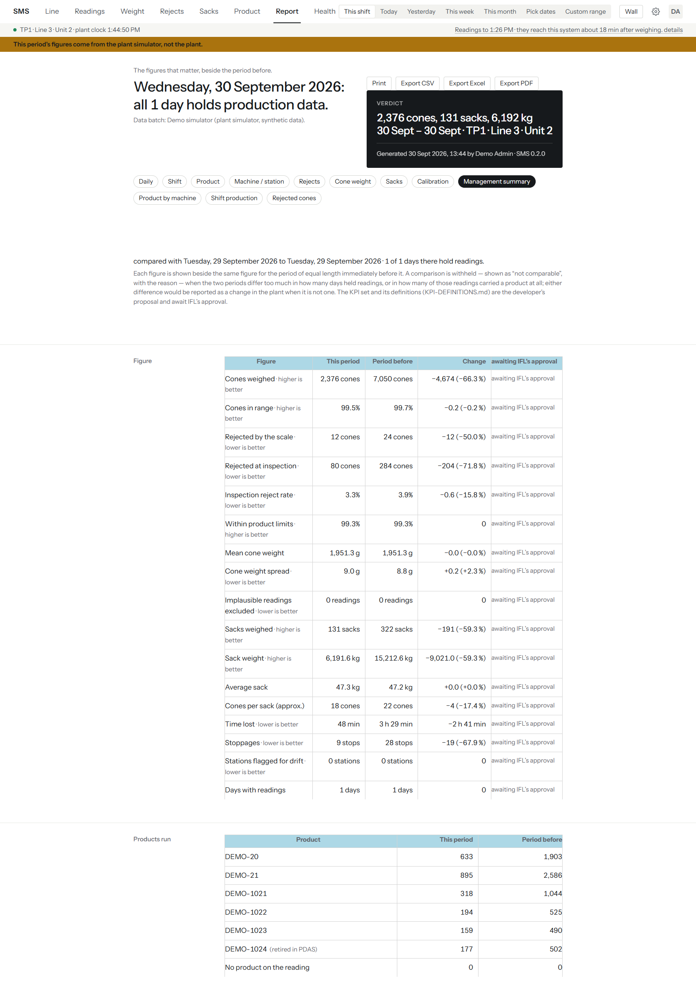

Every row says "awaiting IFL's approval" because the choice and definition of
these figures is the developer's proposal and IFL has not yet approved it.

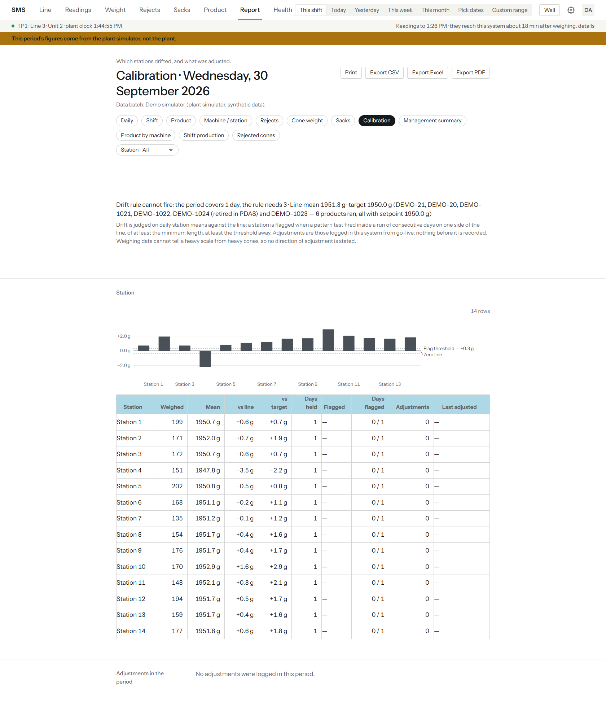

The calibration report needs several days to judge drift, so it says so
rather than showing a verdict for one shift. Choose [[This week]] or longer.

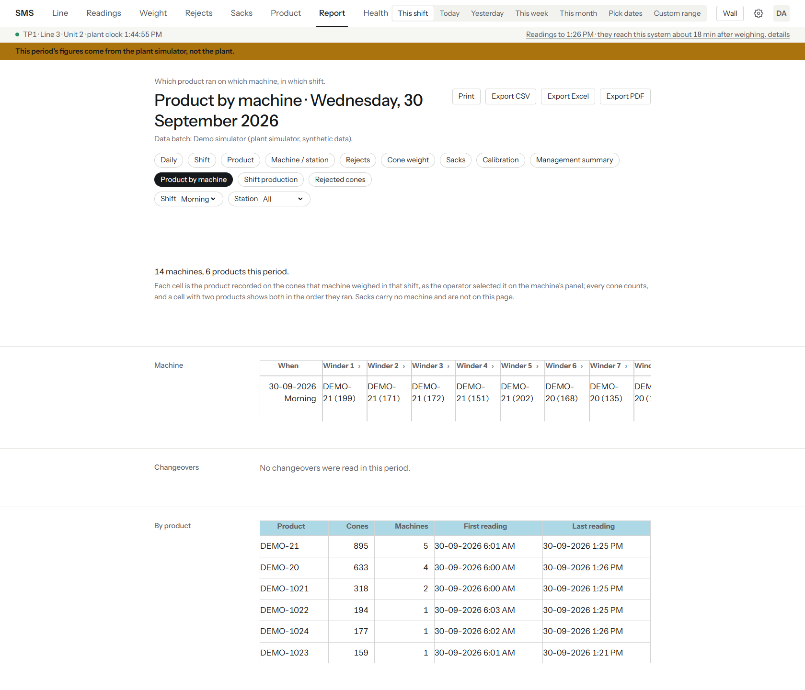

In Product by machine each cell is the product recorded on the machine for
that shift, with the cones it weighed in brackets. A cell with two products
lists both in the order they ran. On paper this report says the same data is in
the CSV export, because it is too wide to print.

## Wall: the fullscreen display {#wall}

The wall display is for a screen or TV that people read from across the
room. It has no menus and refreshes itself.

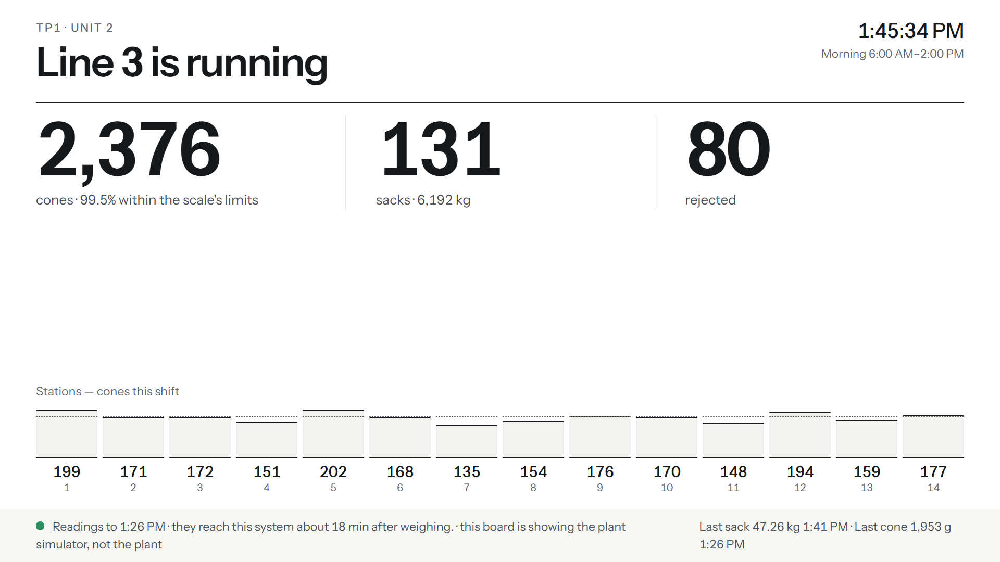

1. Press [[Wall]] in the top bar.
1. Leave it up. It updates by itself.
1. Press Esc or use the browser's back button to return.

| Part | What it tells you |
|---|---|
| Line name and state | Whether the line is running, in very large type. |
| Clock and shift | Plant time and the current shift. |
| The three figures | Cones, sacks and rejected for this shift. |
| Station bars | One bar per station, with the count under it. A shorter bar is a station making fewer cones than the others. |
| Footer | The data delay, and the last sack and cone. On the demo it also says the board shows the simulator. |

## Health: is SMS itself working? {#health}

Health reports on SMS itself, not on the line: the plant link, the database,
the service and the backups. Open it from the top bar.

> **Note:** This demo reads "Something needs attention" for one reason only:
> no backup has been taken (the Backups block says so). On a healthy live
> installation the headline reads as healthy. Do not treat the demo as an
> example of a clean install.

1. Press [[Health]].
1. Read the headline, then any block shown in red.
1. Open the collapsed lines (Data quality findings, Per table, Readings by state) for detail.
1. If something is red, follow {{ref:troubleshooting}}.

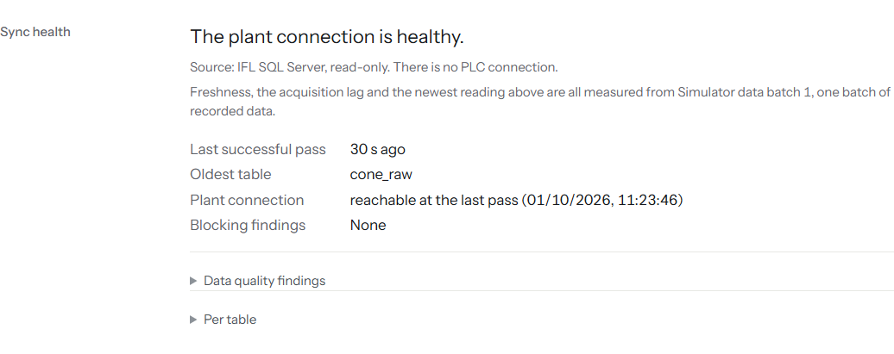

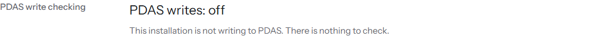

| Block | What it tells you |
|---|---|
| Sync health | Whether the sync worker is reading the plant, when it last succeeded, and whether any finding blocks it. |
| PDAS write checking | Whether SMS is allowed to write to the product database. Off unless deliberately enabled. |
| Reconciliation | A census of the readings SMS holds. It is not a comparison against IFL's database. |
| Data batches | Every physical batch of each source table SMS has read, when it was registered and how many rows it holds. |
| Database | Response time and how much of the 10 GB SQL Server Express limit is used. |
| Service | The SMS version and how long the service has been running. A short uptime beside an old "since" date means it restarted. |
| Backups | Whether a backup was found and proven restorable. Red means the nightly job has stopped. |
| Disk space | Free space on the database and backup volumes. |
| Last manual verification run | When someone last ran the verify command by hand. It is a record, not a live check. |
